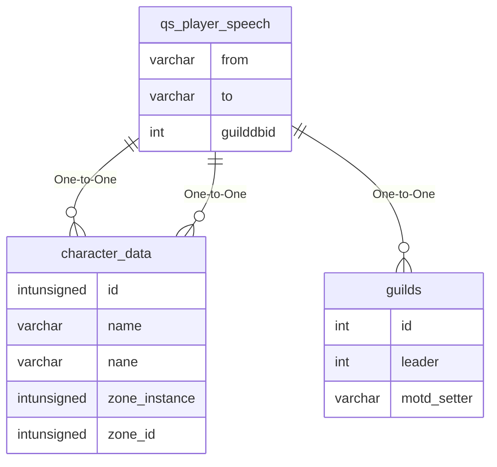

# qs_player_speech

## Relationships

| Relationship Type | Local Key | Relates to Table | Foreign Key |
| :--- | :--- | :--- | :--- |
| One-to-One | from | [character_data](../../schema/characters/character_data.md) | name |
| One-to-One | to | [character_data](../../schema/characters/character_data.md) | name |
| One-to-One | guilddbid | [guilds](../../schema/guilds/guilds.md) | id |

## Schema

| Column | Data Type | Description |
| :--- | :--- | :--- |
| id | int | Unique Speech Identifier |
| from | varchar | [From Character Identifier](../../schema/characters/character_data.md) |
| to | varchar | [To Character Identifier](../../schema/characters/character_data.md) |
| message | varchar | Message |
| minstatus | smallint | [Minimum Status](../../../../server/player/status-levels) |
| guilddbid | int | [Guild Database Identifier](../../schema/guilds/guilds.md) |
| type | tinyint | Type |
| timerecorded | timestamp | Time Recorded Timestamp |

