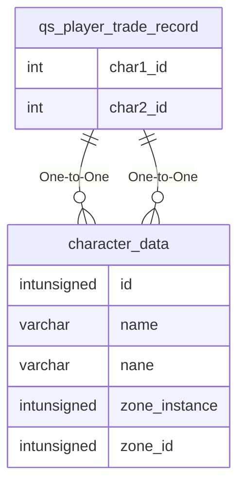

# qs_player_trade_record

!!! info
	This page was last generated 2024.02.07

## Relationship Diagram(s)

## Relationships

| Relationship Type | Local Key | Relates to Table | Foreign Key |
| :--- | :--- | :--- | :--- |
| One-to-One | char1_id | [character_data](../../schema/characters/character_data.md) | id |
| One-to-One | char2_id | [character_data](../../schema/characters/character_data.md) | id |

## Schema

| Column | Data Type | Description |
| :--- | :--- | :--- |
| trade_id | int | Unique Trade Identifier |
| time | timestamp | Time Timestamp |
| char1_id | int | [Character 1 Identifier](../../schema/characters/character_data.md) |
| char1_pp | int | Character 1 Platinum |
| char1_gp | int | Character 1 Gold |
| char1_sp | int | Character 1 Silver |
| char1_cp | int | Character 1 Copper |
| char1_items | mediumint | [Character 1 Item Identifier](../../schema/items/items.md) |
| char2_id | int | [Character 2 Identifier](../../schema/characters/character_data.md) |
| char2_pp | int | Character 2 Platinum |
| char2_gp | int | Character 2 Gold |
| char2_sp | int | Character 2 Silver |
| char2_cp | int | Character 2 Copper |
| char2_items | mediumint | [Character 2 Item Identifier](../../schema/items/items.md) |

