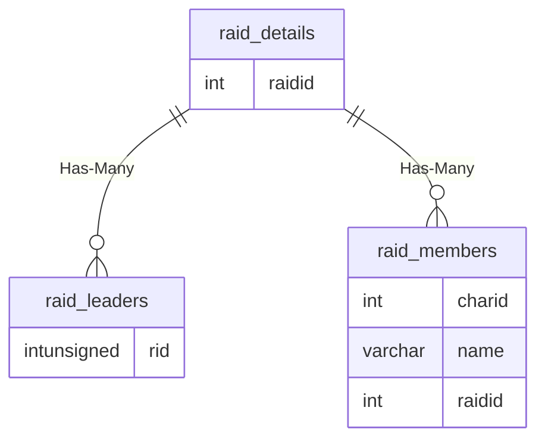

# raid_details

!!! info
	This page was last generated 2024.02.07

## Relationship Diagram(s)

## Relationships

| Relationship Type | Local Key | Relates to Table | Foreign Key |
| :--- | :--- | :--- | :--- |
| Has-Many | raidid | [raid_leaders](../../schema/raids/raid_leaders.md) | rid |
| Has-Many | raidid | [raid_members](../../schema/raids/raid_members.md) | raidid |

## Schema

| Column | Data Type | Description |
| :--- | :--- | :--- |
| raidid | int | Unique Raid Identifier |
| loottype | int | Loot Type |
| locked | tinyint | Locked: 0 = False, 1 = True |
| motd | varchar | Message of the Day |
| marked_npc_1_entity_id | int |  |
| marked_npc_1_zone_id | int |  |
| marked_npc_1_instance_id | int |  |
| marked_npc_2_entity_id | int |  |
| marked_npc_2_zone_id | int |  |
| marked_npc_2_instance_id | int |  |
| marked_npc_3_entity_id | int |  |
| marked_npc_3_zone_id | int |  |
| marked_npc_3_instance_id | int |  |

