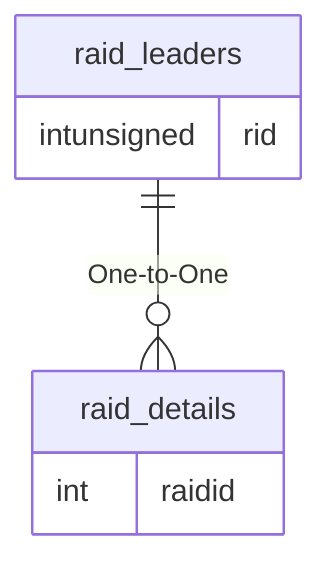

# raid_leaders

## Relationships

| Relationship Type | Local Key | Relates to Table | Foreign Key |
| :--- | :--- | :--- | :--- |
| One-to-One | rid | [raid_details](../../schema/raids/raid_details.md) | raidid |

## Schema

| Column | Data Type | Description |
| :--- | :--- | :--- |
| gid | int | [Group Identifier](../../schema/groups/group_id.md) |
| rid | int | [Raid Identifier](raid_details.md) |
| marknpc | varchar | Mark NPC: 0 = False, 1 = True |
| maintank | varchar | Main Tank: 0 = False, 1 = True |
| assist | varchar | Assist: 0 = False, 1 = True |
| puller | varchar | Puller: 0 = False, 1 = True |
| leadershipaa | tinyblob | Leadership AA |
| mentoree | varchar | Mentoree: 0 = False, 1 = True |
| mentor_percent | int | Mentore Percent: 0 = None, 100 = Max |

