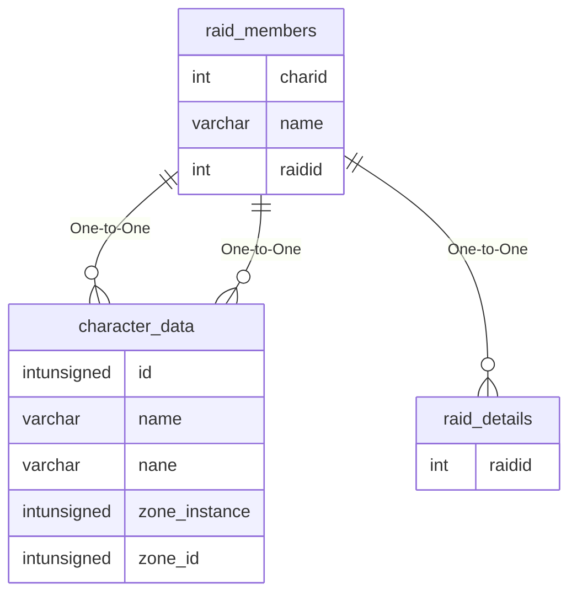

# raid_members

## Relationships

| Relationship Type | Local Key | Relates to Table | Foreign Key |
| :--- | :--- | :--- | :--- |
| One-to-One | charid | [character_data](../../schema/characters/character_data.md) | id |
| One-to-One | name | [character_data](../../schema/characters/character_data.md) | name |
| One-to-One | raidid | [raid_details](../../schema/raids/raid_details.md) | raidid |

## Schema

| Column | Data Type | Description |
| :--- | :--- | :--- |
| id | bigint | Unique Raid Member Identifier |
| raidid | int | [Raid Identifier](raid_details.md) |
| charid | int | [Character Identifier](../../schema/characters/character_data.md) |
| bot_id | int | [Bot Identifier](../../schema/bots/bot_data.md) |
| groupid | int | [Group Identifier](../../schema/groups/group_id.md) |
| _class | tinyint | [Class](../../../../server/player/class-list) |
| level | tinyint | Level |
| name | varchar | Name |
| isgroupleader | tinyint | Is Group Leader: 0 = False, 1 = True |
| israidleader | tinyint | Is Raid Leader: 0 = False, 1 = True |
| islooter | tinyint | Is Looter: 0 = False, 1 = True |
| is_marker | tinyint | Is Marker: 0 = False, 1 = True |
| is_assister | tinyint | Is Assister: 0 = False, 1 = True |
| note | varchar | Note |

