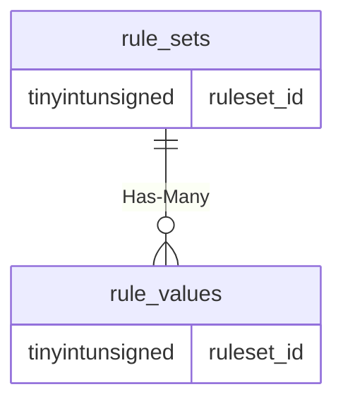

# rule_sets

!!! info
	This page was last generated 2024.02.07

## Relationship Diagram(s)

## Relationships

| Relationship Type | Local Key | Relates to Table | Foreign Key |
| :--- | :--- | :--- | :--- |
| Has-Many | ruleset_id | [rule_values](../../schema/rules/rule_values.md) | ruleset_id |

## Schema

| Column | Data Type | Description |
| :--- | :--- | :--- |
| ruleset_id | tinyint | Unique Rule Set Identifier |
| name | varchar | Name |

