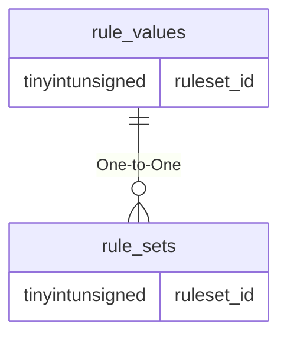

# rule_values

!!! info
	This page was last generated 2024.02.07

## Relationship Diagram(s)

## Relationships

| Relationship Type | Local Key | Relates to Table | Foreign Key |
| :--- | :--- | :--- | :--- |
| One-to-One | ruleset_id | [rule_sets](../../schema/rules/rule_sets.md) | ruleset_id |

## Schema

| Column | Data Type | Description |
| :--- | :--- | :--- |
| ruleset_id | tinyint | [Rule Set Identifier](rule_sets.md) |
| rule_name | varchar | Rule Name |
| rule_value | varchar | Rule Value |
| notes | text | Notes |

