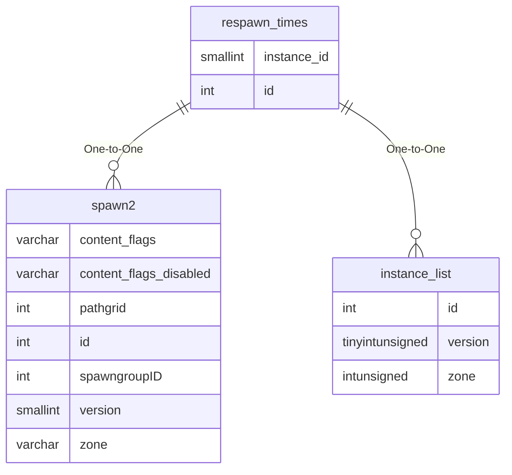

# respawn_times

## Relationships

| Relationship Type | Local Key | Relates to Table | Foreign Key |
| :--- | :--- | :--- | :--- |
| One-to-One | id | [spawn2](../../schema/spawns/spawn2.md) | id |
| One-to-One | instance_id | [instance_list](../../schema/instances/instance_list.md) | id |

## Schema

| Column | Data Type | Description |
| :--- | :--- | :--- |
| id | int | Unique Respawn Time Identifier |
| start | int | Start UNIX Timestamp |
| duration | int | Duration in Seconds |
| instance_id | smallint | [Instance Identifier](../../schema/instances/instance_list.md) |

