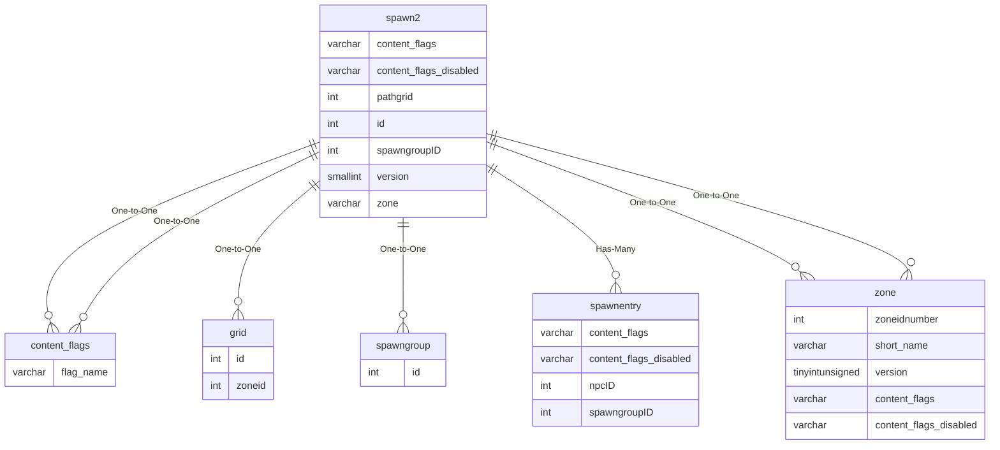

# spawn2

!!! info
	This page was last generated 2024.02.07

## Relationship Diagram(s)

## Relationships

| Relationship Type | Local Key | Relates to Table | Foreign Key |
| :--- | :--- | :--- | :--- |
| One-to-One | content_flags | [content_flags](../../schema/flagging/content_flags.md) | flag_name |
| One-to-One | content_flags_disabled | [content_flags](../../schema/flagging/content_flags.md) | flag_name |
| One-to-One | pathgrid | [grid](../../schema/grids/grid.md) | id |
| One-to-One | spawngroupID | [spawngroup](../../schema/spawns/spawngroup.md) | id |
| Has-Many | spawngroupID | [spawnentry](../../schema/spawns/spawnentry.md) | spawngroupID |
| One-to-One | version | [zone](../../schema/zone/zone.md) | version |
| One-to-One | zone | [zone](../../schema/zone/zone.md) | short_name |

## Schema

| Column | Data Type | Description |
| :--- | :--- | :--- |
| id | int | Unique Spawn2 Entry Identifier |
| spawngroupID | int | [Unique Spawngroup Identifier](spawngroup.md) |
| zone | varchar | [Zone Short Name](../../../../server/zones/zone-list) |
| version | smallint | Version |
| x | float | X Coordinate |
| y | float | Y Coordinate |
| z | float | Z Coordinate |
| heading | float | Heading Coordinate |
| respawntime | int | Respawn Time in Seconds |
| variance | int | Variance in Seconds |
| pathgrid | int | [Path Grid Identifier](../../schema/grids/grid.md) |
| path_when_zone_idle | tinyint | Path When Zone Idle: 0 = False, 1 = True |
| _condition | mediumint | Condition |
| cond_value | mediumint | Condition Value |
| animation | tinyint | [Animation](../../../../server/npc/npc-animation-types) |
| min_expansion | tinyint | [Minimum Expansion](../../../../server/operation/expansion-list) |
| max_expansion | tinyint | [Maximum Expansion](../../../../server/operation/expansion-list) |
| content_flags | varchar | Content Flags Required to be Enabled |
| content_flags_disabled | varchar | Content Flags Required to be Disabled |

