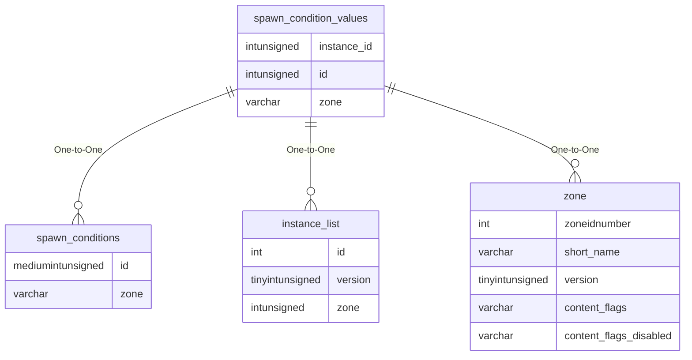

# spawn_condition_values

!!! info
	This page was last generated 2024.02.07

## Relationship Diagram(s)

## Relationships

| Relationship Type | Local Key | Relates to Table | Foreign Key |
| :--- | :--- | :--- | :--- |
| One-to-One | id | [spawn_conditions](../../schema/spawns/spawn_conditions.md) | id |
| One-to-One | instance_id | [instance_list](../../schema/instances/instance_list.md) | id |
| One-to-One | zone | [zone](../../schema/zone/zone.md) | short_name |

## Schema

| Column | Data Type | Description |
| :--- | :--- | :--- |
| id | int | [Spawn Condition Identifier](spawn_conditions.md) |
| value | tinyint | Value |
| zone | varchar | [Zone Short Name](../../../../server/zones/zone-list) |
| instance_id | int | [Instance Identifier](../../schema/instances/instance_list.md) |

