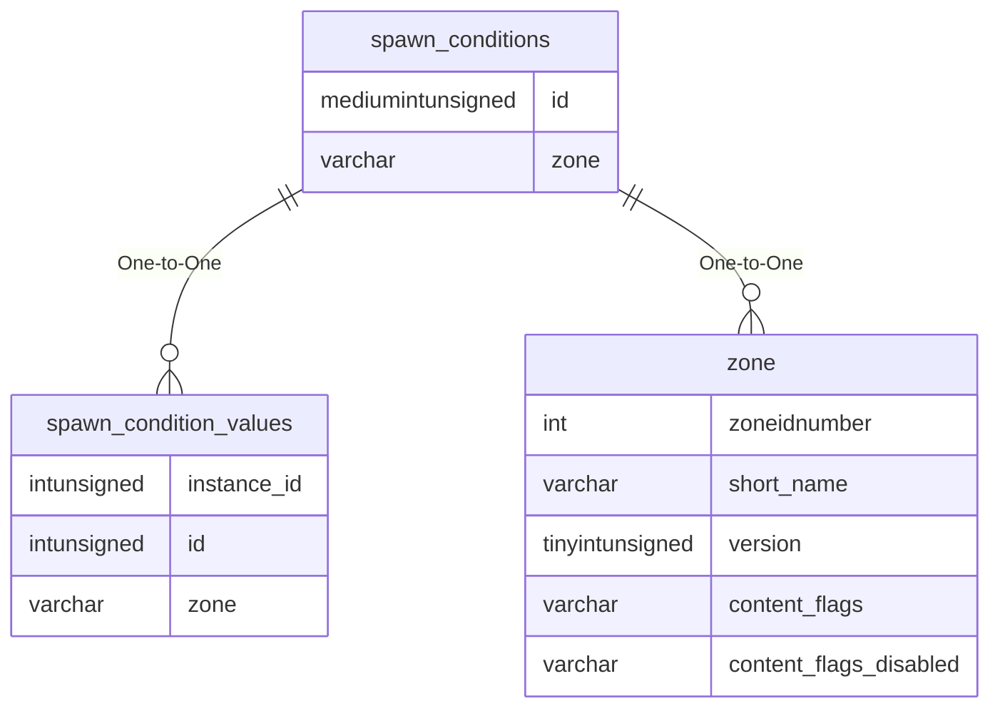

# spawn_conditions

!!! info
	This page was last generated 2024.02.07

## Relationship Diagram(s)

## Relationships

| Relationship Type | Local Key | Relates to Table | Foreign Key |
| :--- | :--- | :--- | :--- |
| One-to-One | id | [spawn_condition_values](../../schema/spawns/spawn_condition_values.md) | id |
| One-to-One | zone | [zone](../../schema/zone/zone.md) | short_name |

## Schema

| Column | Data Type | Description |
| :--- | :--- | :--- |
| zone | varchar | [Zone Short Name](../../../../server/zones/zone-list) |
| id | mediumint | Spawn Condition Identifier |
| value | mediumint | Value |
| onchange | tinyint | [On Change Type](../../../../server/npc/spawns/on-change-types) |
| name | varchar | Name |

