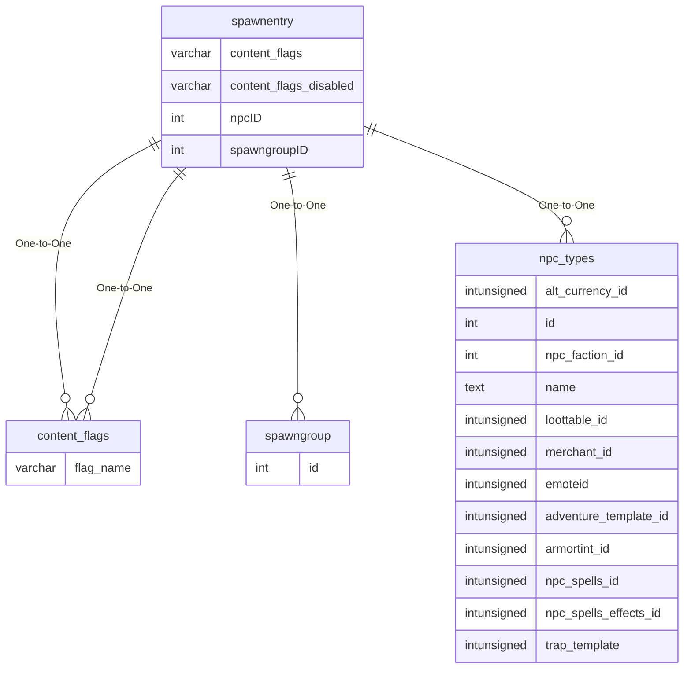

# spawnentry

## Relationships

| Relationship Type | Local Key | Relates to Table | Foreign Key |
| :--- | :--- | :--- | :--- |
| One-to-One | content_flags | [content_flags](../../schema/flagging/content_flags.md) | flag_name |
| One-to-One | content_flags_disabled | [content_flags](../../schema/flagging/content_flags.md) | flag_name |
| One-to-One | spawngroupID | [spawngroup](../../schema/spawns/spawngroup.md) | id |
| One-to-One | npcID | [npc_types](../../schema/npcs/npc_types.md) | id |

## Schema

| Column | Data Type | Description |
| :--- | :--- | :--- |
| spawngroupID | int | [Unique Spawn Group Identifier](spawngroup.md) |
| npcID | int | [NPC Type Identifier](../../schema/npcs/npc_types.md) |
| chance | smallint | Chance: 0 = Never, 100 = Always |
| condition_value_filter | mediumint | Condition Value Filter |
| min_time | smallint |  |
| max_time | smallint |  |
| min_expansion | tinyint | [Minimum Expansion](../../../../server/operation/expansion-list) |
| max_expansion | tinyint | [Maximum Expansion](../../../../server/operation/expansion-list) |
| content_flags | varchar | Content Flags Required to be Enabled |
| content_flags_disabled | varchar | Content Flags Required to be Disabled |

