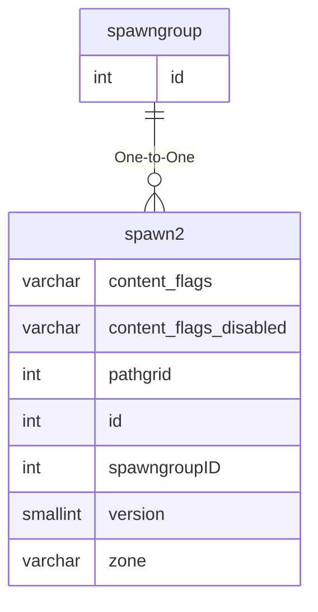

# spawngroup

## Relationships

| Relationship Type | Local Key | Relates to Table | Foreign Key |
| :--- | :--- | :--- | :--- |
| One-to-One | id | [spawn2](../../schema/spawns/spawn2.md) | spawngroupID |

## Schema

| Column | Data Type | Description |
| :--- | :--- | :--- |
| id | int | Unique Spawn Group Identifier |
| name | varchar | Name |
| spawn_limit | tinyint | Spawn Limit |
| dist | float | Distance |
| max_x | float | Max X Coordinate |
| min_x | float | Min X Coordinate |
| max_y | float | Max Y Coordinate |
| min_y | float | Min Y Coordinate |
| delay | int | Roaming Delay |
| mindelay | int | Minimum Delay |
| despawn | tinyint | [Despawn Type](../../../../server/npc/spawns/npc-despawn-types) |
| despawn_timer | int | Despawn Timer in Seconds |
| wp_spawns | tinyint | Waypoint Spawns: 0 = False, 1 = True |

