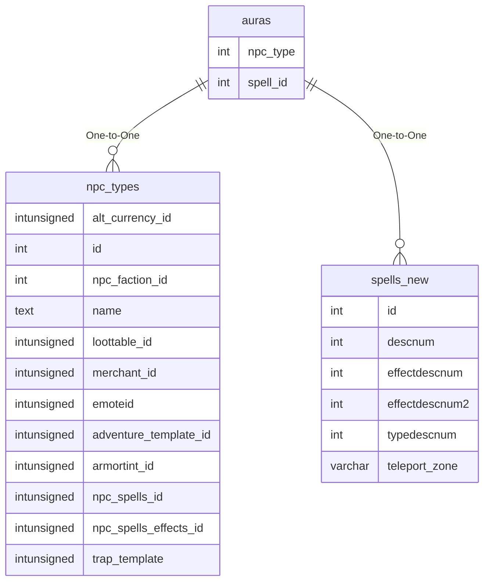

# auras

## Relationships

| Relationship Type | Local Key | Relates to Table | Foreign Key |
| :--- | :--- | :--- | :--- |
| One-to-One | npc_type | [npc_types](../../schema/npcs/npc_types.md) | id |
| One-to-One | spell_id | [spells_new](../../schema/spells/spells_new.md) | id |

## Schema

| Column | Data Type | Description |
| :--- | :--- | :--- |
| type | int | Unique Aura Identifier |
| npc_type | int | [NPC Type Identifier](../../schema/npcs/npc_types.md) |
| name | varchar | Name |
| spell_id | int | [Spell Identifier](spells_new.md) |
| distance | int | Distance |
| aura_type | int | [Aura Type](../../../../server/spells/aura-types) |
| spawn_type | int | [Aura Spawn Type](../../../../server/spells/aura-spawn-types) |
| movement | int | [Aura Movement Type](../../../../server/spells/aura-movement-types) |
| duration | int | Duration |
| icon | int | Icon |
| cast_time | int | Cast Time |

