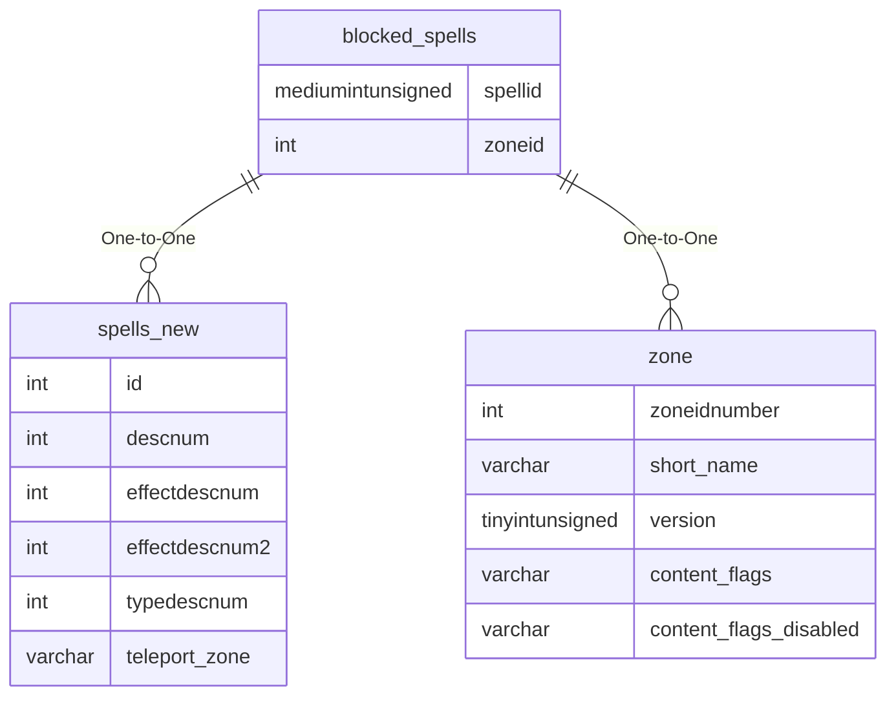

# blocked_spells

## Relationships

| Relationship Type | Local Key | Relates to Table | Foreign Key |
| :--- | :--- | :--- | :--- |
| One-to-One | spellid | [spells_new](../../schema/spells/spells_new.md) | id |
| One-to-One | zoneid | [zone](../../schema/zone/zone.md) | zoneidnumber |

## Schema

| Column | Data Type | Description |
| :--- | :--- | :--- |
| id | int | Unique Blocked Spells Identifier |
| spellid | mediumint | [Spell Identifier](spells_new.md) |
| type | tinyint | [Blocked Spell Type](../../../../server/spells/blocked-spell-types) |
| zoneid | int | [Zone Identifier](../../../../server/zones/zone-list) |
| x | float | X Coordinate |
| y | float | Y Coordinate |
| z | float | Z Coordinate |
| x_diff | float | X Radius |
| y_diff | float | Y Radius |
| z_diff | float | Z Radius |
| message | varchar | Message when blocked |
| description | varchar | Blocked spells description |
| min_expansion | tinyint |  |
| max_expansion | tinyint |  |
| content_flags | varchar |  |
| content_flags_disabled | varchar |  |

