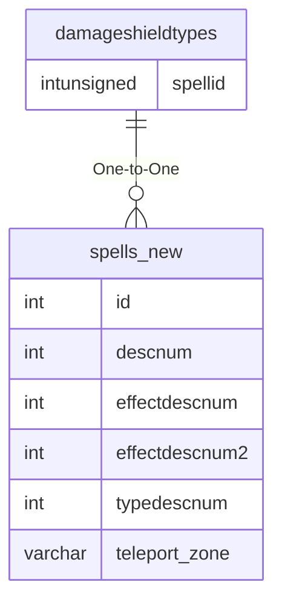

# damageshieldtypes

!!! info
	This page was last generated 2024.02.07

## Relationship Diagram(s)

## Relationships

| Relationship Type | Local Key | Relates to Table | Foreign Key |
| :--- | :--- | :--- | :--- |
| One-to-One | spellid | [spells_new](../../schema/spells/spells_new.md) | id |

## Schema

| Column | Data Type | Description |
| :--- | :--- | :--- |
| spellid | int | [Spell Identifier](spells_new.md) |
| type | tinyint | [Damage Shield Type](../../../../server/spells/damage-shield-types) |

