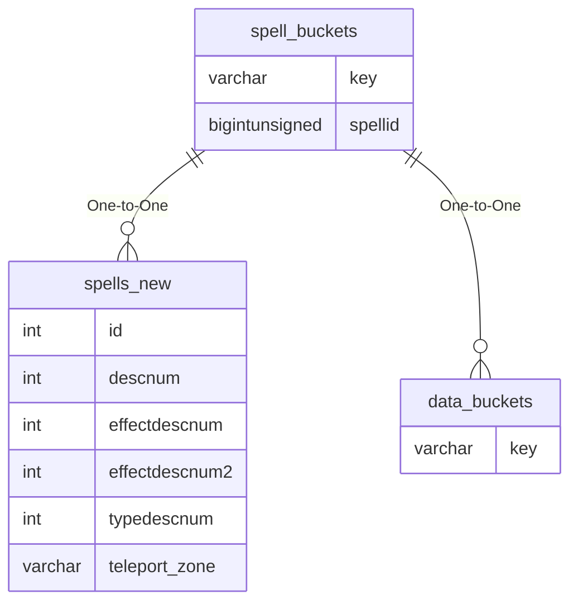

# spell_buckets

!!! info
	This page was last generated 2024.02.07

## Relationship Diagram(s)

## Relationships

| Relationship Type | Local Key | Relates to Table | Foreign Key |
| :--- | :--- | :--- | :--- |
| One-to-One | spellid | [spells_new](../../schema/spells/spells_new.md) | id |
| One-to-One | key | [data_buckets](../../schema/data-storage/data_buckets.md) | key |

## Schema

| Column | Data Type | Description |
| :--- | :--- | :--- |
| spellid | bigint | [Unique Spell Identifier](spells_new.md) |
| key | varchar | [Data Bucket Name](../../schema/data-storage/data_buckets.md) |
| value | text | Data Bucket Value |

