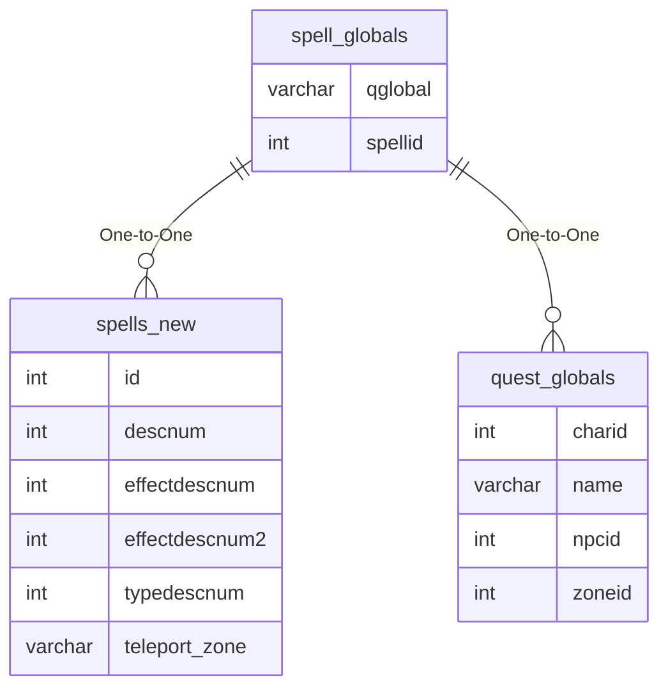

# spell_globals

## Relationships

| Relationship Type | Local Key | Relates to Table | Foreign Key |
| :--- | :--- | :--- | :--- |
| One-to-One | spellid | [spells_new](../../schema/spells/spells_new.md) | id |
| One-to-One | qglobal | [quest_globals](../../schema/data-storage/quest_globals.md) | name |

## Schema

| Column | Data Type | Description |
| :--- | :--- | :--- |
| spellid | int | [Unique Spell Identifier](spells_new.md) |
| spell_name | varchar | [Spell Name](spells_new.md) |
| qglobal | varchar | [Quest Global Name](../../schema/data-storage/quest_globals.md) |
| value | varchar | Quest Global Value |

