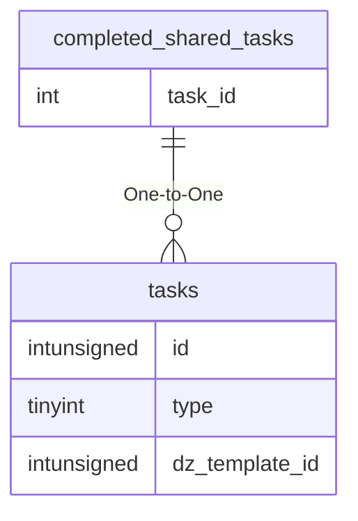

# completed_shared_tasks

## Relationships

| Relationship Type | Local Key | Relates to Table | Foreign Key |
| :--- | :--- | :--- | :--- |
| One-to-One | task_id | [tasks](../../schema/tasks/tasks.md) | id |

## Schema

| Column | Data Type | Description |
| :--- | :--- | :--- |
| id | bigint | [Shared Task Identifier](shared_tasks.md) |
| task_id | int | [Shared Task Identifier](shared_tasks.md) |
| accepted_time | datetime | Accepted Time |
| expire_time | datetime | Expire TIme |
| completion_time | datetime | Completion TIme |
| is_locked | tinyint | Is Locked: 0 = False, 1 = True |

