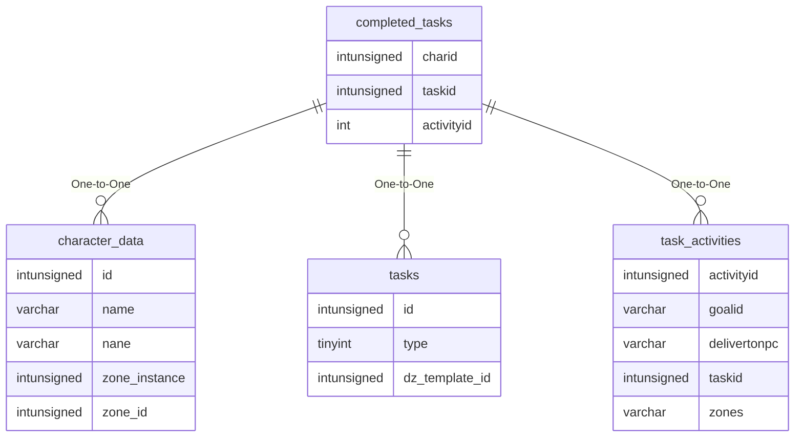

# completed_tasks

!!! info
	This page was last generated 2024.02.07

## Relationship Diagram(s)

## Relationships

| Relationship Type | Local Key | Relates to Table | Foreign Key |
| :--- | :--- | :--- | :--- |
| One-to-One | charid | [character_data](../../schema/characters/character_data.md) | id |
| One-to-One | taskid | [tasks](../../schema/tasks/tasks.md) | id |
| One-to-One | activityid | [task_activities](../../schema/tasks/task_activities.md) | activityid |

## Schema

| Column | Data Type | Description |
| :--- | :--- | :--- |
| charid | int | [Character Identifier](../../schema/characters/character_data.md) |
| completedtime | int | Completed Time UNIX Timestamp |
| taskid | int | [Task Identifier](tasks.md) |
| activityid | int | [Activity Identifier](task_activities.md) |

