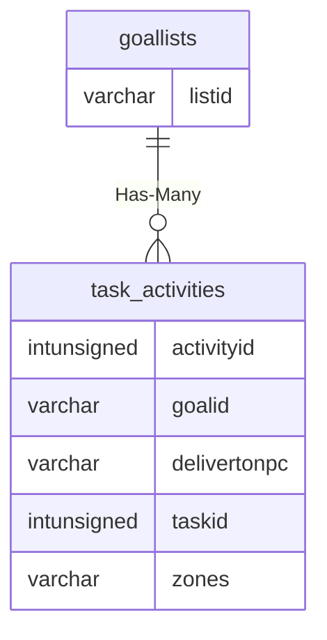

# goallists

!!! info
	This page was last generated 2024.02.07

## Relationship Diagram(s)

## Relationships

| Relationship Type | Local Key | Relates to Table | Foreign Key |
| :--- | :--- | :--- | :--- |
| Has-Many | listid | [task_activities](../../schema/tasks/task_activities.md) | goalid |

## Schema

| Column | Data Type | Description |
| :--- | :--- | :--- |
| listid | int | Goal List Identifier |
| entry | int | Entry Identifier |

