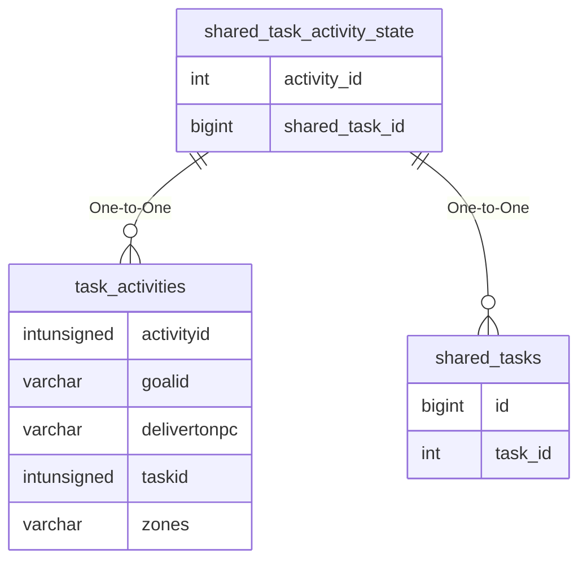

# shared_task_activity_state

!!! info
	This page was last generated 2024.02.07

## Relationship Diagram(s)

## Relationships

| Relationship Type | Local Key | Relates to Table | Foreign Key |
| :--- | :--- | :--- | :--- |
| One-to-One | activity_id | [task_activities](../../schema/tasks/task_activities.md) | activityid |
| One-to-One | shared_task_id | [shared_tasks](../../schema/tasks/shared_tasks.md) | id |

## Schema

| Column | Data Type | Description |
| :--- | :--- | :--- |
| shared_task_id | bigint | [Shared Task Identifier](shared_tasks.md) |
| activity_id | int | [Activity Identifier](task_activities.md) |
| done_count | int | Done Count |
| updated_time | datetime | Updated Time |
| completed_time | datetime | Completed Time |

