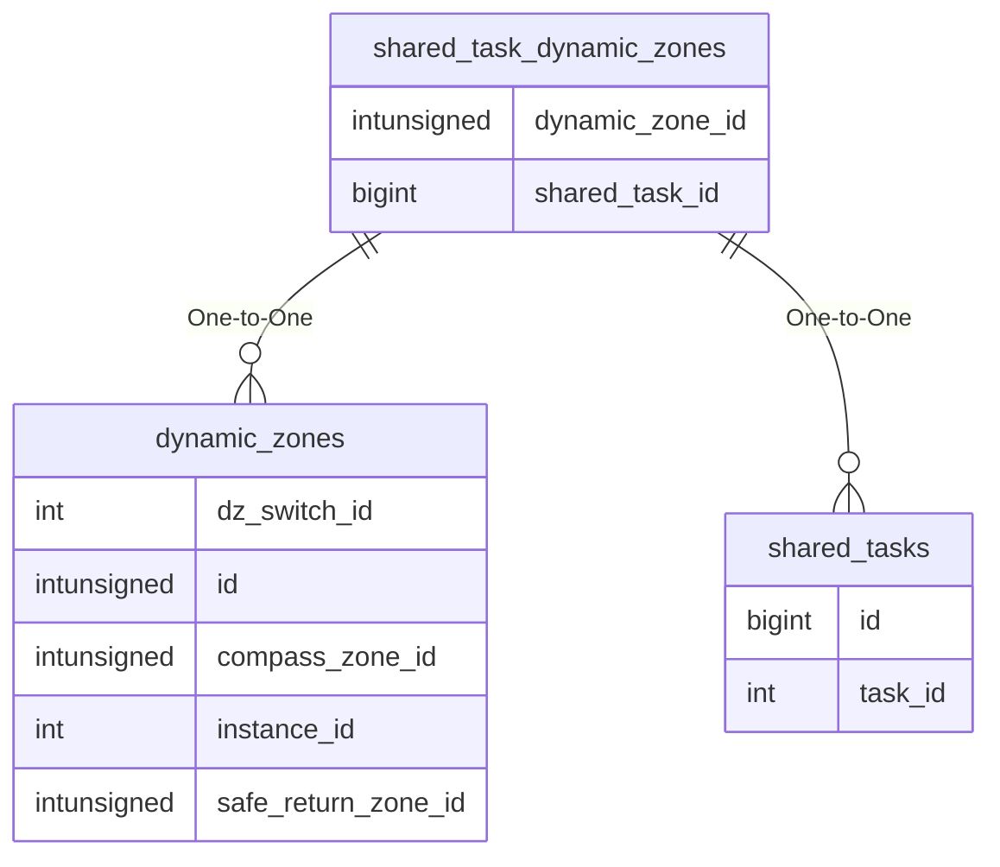

# shared_task_dynamic_zones

!!! info
	This page was last generated 2024.02.07

## Relationship Diagram(s)

## Relationships

| Relationship Type | Local Key | Relates to Table | Foreign Key |
| :--- | :--- | :--- | :--- |
| One-to-One | dynamic_zone_id | [dynamic_zones](../../schema/tasks/shared_task_dynamic_zones.md) | id |
| One-to-One | shared_task_id | [shared_tasks](../../schema/tasks/shared_tasks.md) | id |

## Schema

| Column | Data Type | Description |
| :--- | :--- | :--- |
| shared_task_id | bigint | [Shared Task Identifier](shared_tasks.md) |
| dynamic_zone_id | int | [Dynamic Zone Identifier](../../schema/dynamic-zones/dynamic_zones.md) |

