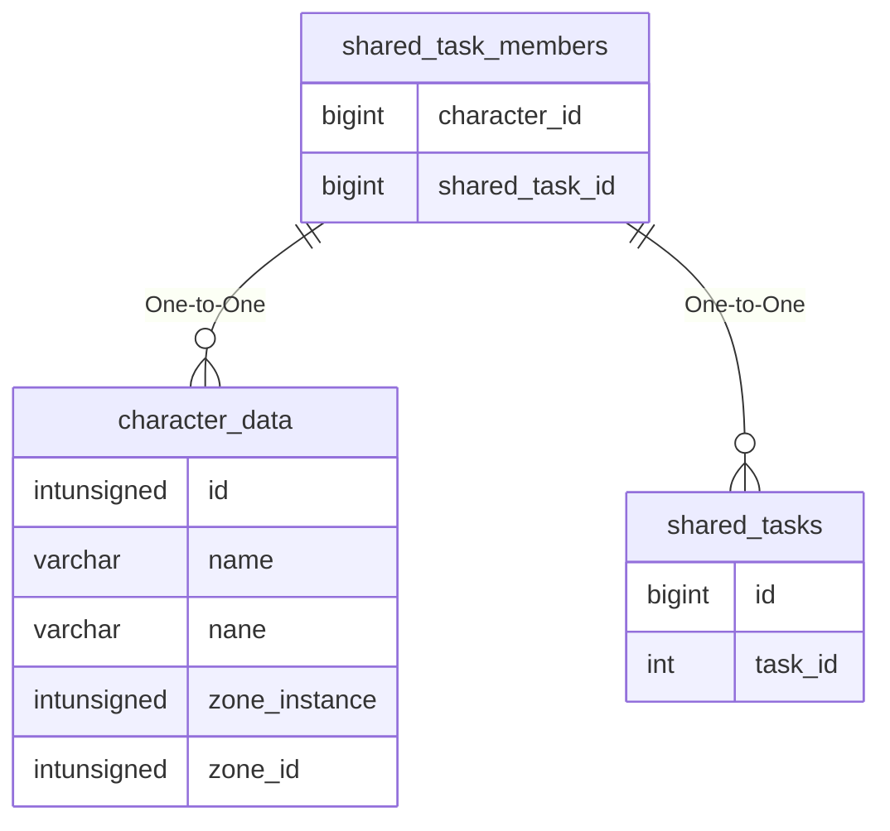

# shared_task_members

## Relationships

| Relationship Type | Local Key | Relates to Table | Foreign Key |
| :--- | :--- | :--- | :--- |
| One-to-One | character_id | [character_data](../../schema/characters/character_data.md) | id |
| One-to-One | shared_task_id | [shared_tasks](../../schema/tasks/shared_tasks.md) | id |

## Schema

| Column | Data Type | Description |
| :--- | :--- | :--- |
| shared_task_id | bigint | [Shared Task Identifier](shared_tasks.md) |
| character_id | bigint | [Character Identifier](../../schema/characters/character_data.md) |
| is_leader | tinyint | Is Leader: 0 = False, 1 = True |

