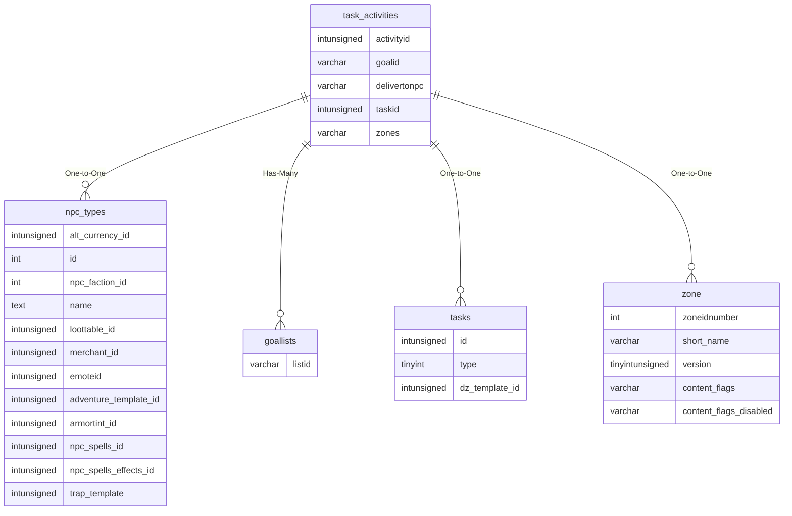

# task_activities

!!! info
	This page was last generated 2024.02.07

## Relationship Diagram(s)

## Relationships

| Relationship Type | Local Key | Relates to Table | Foreign Key |
| :--- | :--- | :--- | :--- |
| One-to-One | delivertonpc | [npc_types](../../schema/npcs/npc_types.md) | id |
| Has-Many | goalid | [goallists](../../schema/tasks/goallists.md) | listid |
| One-to-One | taskid | [tasks](../../schema/tasks/tasks.md) | id |
| One-to-One | zones | [zone](../../schema/zone/zone.md) | zoneidnumber |

## Schema

| Column | Data Type | Description |
| :--- | :--- | :--- |
| taskid | int | [Task Identifier](tasks.md) |
| activityid | int | Activity Identifier: Starts at 0 |
| req_activity_id | int | Required Activity Identifier |
| step | int | Step: 0 = Always Available, &gt;0 = Must Complete Previous |
| activitytype | tinyint | [Activity Type](../../../../server/task-system-guide/task-activity-types) |
| target_name | varchar | Target Name |
| goalmethod | int | Goal Method: 0 = Single Value, 1 = List |
| goalcount | int | Goal Count |
| description_override | varchar | Description Override |
| goalid | int | Goal Identifier or [Goal List Identifier](goallists.md) |
| item_id_list | text | [Item Identifier List](../../schema/items/items.md) |
| item_list | varchar | [Item Identifier List](../../schema/items/items.md) |
| dz_switch_id | int | [Dynamic Zone Switch ID](../../schema/doors/doors.md) |
| delivertonpc | int | Deliver To NPC: 0 = No Delivery NPC, &gt;0 = [NPC Type Identifier](../../schema/npcs/npc_types.md) |
| min_y | float | Minimum Y Coordinate |
| min_z | float | Minimum Z Coordinate |
| max_x | float | Maximum X Coordinate |
| max_y | float | Maximum Y Coordinate |
| max_z | float | Maximum Z Coordinate |
| skill_list | varchar | [Skill Identifier List](../../../../server/player/skills) |
| spell_list | varchar | [Spell Identifier List](../../schema/spells/spells_new.md) |
| zones | varchar | [Zones List](../../../../server/zones/zone-list) |
| zone_version | int | Zone Version |
| optional | tinyint | Optional: 0 = False, 1 = True |
| list_group | tinyint |  |

