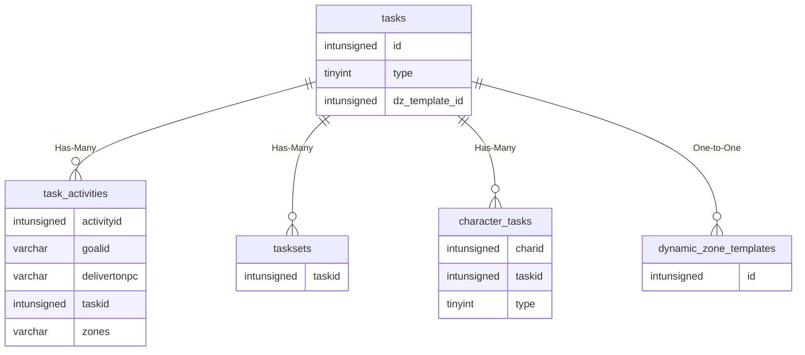

# tasks

!!! info
	This page was last generated 2024.02.07

## Relationship Diagram(s)

## Relationships

| Relationship Type | Local Key | Relates to Table | Foreign Key |
| :--- | :--- | :--- | :--- |
| Has-Many | id | [task_activities](../../schema/tasks/task_activities.md) | taskid |
| Has-Many | id | [tasksets](../../schema/tasks/tasksets.md) | taskid |
| Has-Many | type | [character_tasks](../../schema/characters/character_tasks.md) | type |
| One-to-One | dz_template_id | [dynamic_zone_templates](../../schema/dynamic-zones/dynamic_zone_templates.md) | id |

## Schema

| Column | Data Type | Description |
| :--- | :--- | :--- |
| id | int | Unique Task Identifier |
| type | tinyint | [Task Type](../../../../server/task-system-guide/task-types) |
| duration | int | Duration |
| duration_code | tinyint | [Duration Code](../../../../server/task-system-guide/task-duration-codes) |
| title | varchar | Title |
| description | text | Description |
| reward_text | varchar | Reward Text |
| reward_id_list | text | Reward ID List |
| cash_reward | int | Cash Reward in Copper |
| exp_reward | int | Experience Reward |
| reward_method | tinyint | Reward Method |
| reward_points | int | Reward Points |
| reward_point_type | int | Reward Point Type: 4 = Radiant, 5 = Ebon |
| min_level | tinyint | Minimum Level |
| max_level | tinyint | Maximum Level |
| level_spread | int | Level Spread |
| min_players | int | Minimum Players |
| max_players | int | Maximum Players |
| repeatable | tinyint | Repeatable: 0 = False, 1 = True |
| faction_reward | int | Faction Reward |
| completion_emote | varchar | Completion Emote |
| replay_timer_group | int | Group Replay Timer in Seconds |
| replay_timer_seconds | int | Replay Timer in Seconds |
| request_timer_group | int | Group Request Timer in Seconds |
| request_timer_seconds | int | Request Timer in Seconds |
| dz_template_id | int | [Dynamic Zone Template Identifier](../../schema/dynamic-zones/dynamic_zone_templates.md) |
| lock_activity_id | int | [Lock Activity Identifier](../../schema/tasks/task_activities.md) |
| faction_amount | int | Faction Amount |
| enabled | smallint |  |

