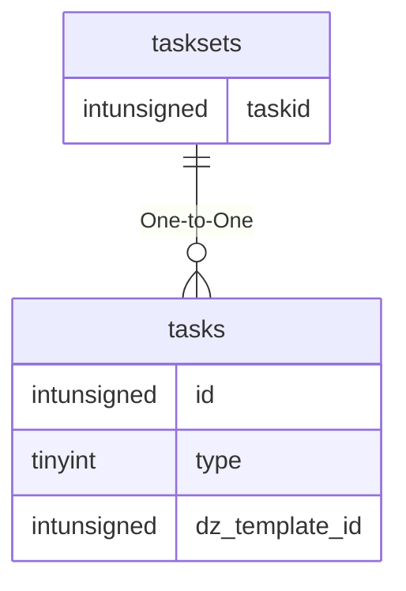

# tasksets

!!! info
	This page was last generated 2024.02.07

## Relationship Diagram(s)

## Relationships

| Relationship Type | Local Key | Relates to Table | Foreign Key |
| :--- | :--- | :--- | :--- |
| One-to-One | taskid | [tasks](../../schema/tasks/tasks.md) | id |

## Schema

| Column | Data Type | Description |
| :--- | :--- | :--- |
| id | int | Unique Task Set Entry Identifier |
| taskid | int | [Task Identifier](tasks.md) |

