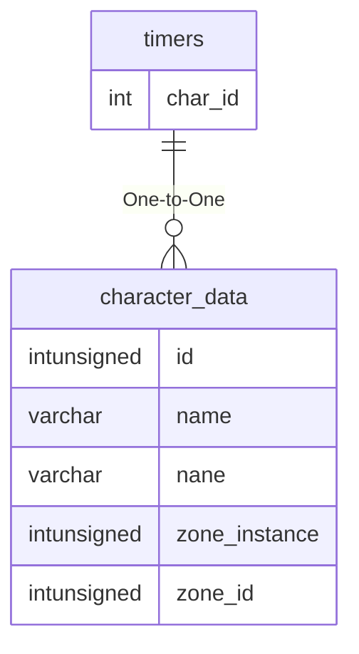

# timers

## Relationships

| Relationship Type | Local Key | Relates to Table | Foreign Key |
| :--- | :--- | :--- | :--- |
| One-to-One | char_id | [character_data](../../schema/characters/character_data.md) | id |

## Schema

| Column | Data Type | Description |
| :--- | :--- | :--- |
| char_id | int | [Unique Character Identifier](../../schema/characters/character_data.md) |
| type | mediumint | Type |
| start | int | Start UNIX Timestamp |
| duration | int | Duration |
| enable | tinyint | Enabled: 0 = False, 1 = True |

