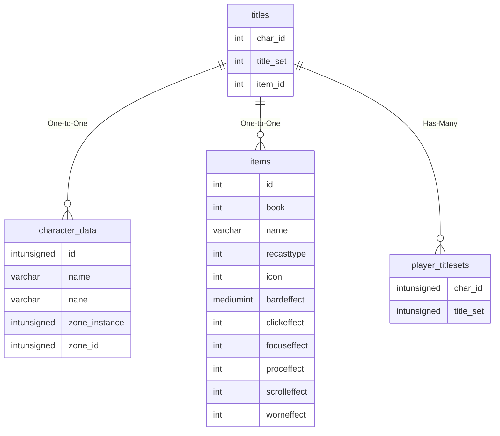

# titles

!!! info
	This page was last generated 2024.02.07

## Relationship Diagram(s)

## Relationships

| Relationship Type | Local Key | Relates to Table | Foreign Key |
| :--- | :--- | :--- | :--- |
| One-to-One | char_id | [character_data](../../schema/characters/character_data.md) | id |
| One-to-One | item_id | [items](../../schema/items/items.md) | id |
| Has-Many | title_set | [player_titlesets](../../schema/characters/player_titlesets.md) | title_set |

## Schema

| Column | Data Type | Description |
| :--- | :--- | :--- |
| id | int | Unique Title Identifier |
| skill_id | tinyint | [Skill Identifier](../../../../server/player/skills) |
| min_skill_value | mediumint | Minimum Skill Value |
| max_skill_value | mediumint | Maximum Skill Value |
| min_aa_points | mediumint | Minimum AA Points |
| max_aa_points | mediumint | Maximum AA Points |
| class | tinyint | [Class](../../../../server/player/class-list) |
| gender | tinyint | [Gender](../../../../server/npc/genders) |
| char_id | int | [Unique Character Identifier](../../schema/characters/character_data) |
| status | int | [Required Status](../../../../server/player/status-levels) |
| item_id | int | [Item Identifier](../../schema/items/items) |
| prefix | varchar | Prefix |
| suffix | varchar | Suffix |
| title_set | int | Title Set Identifier |

