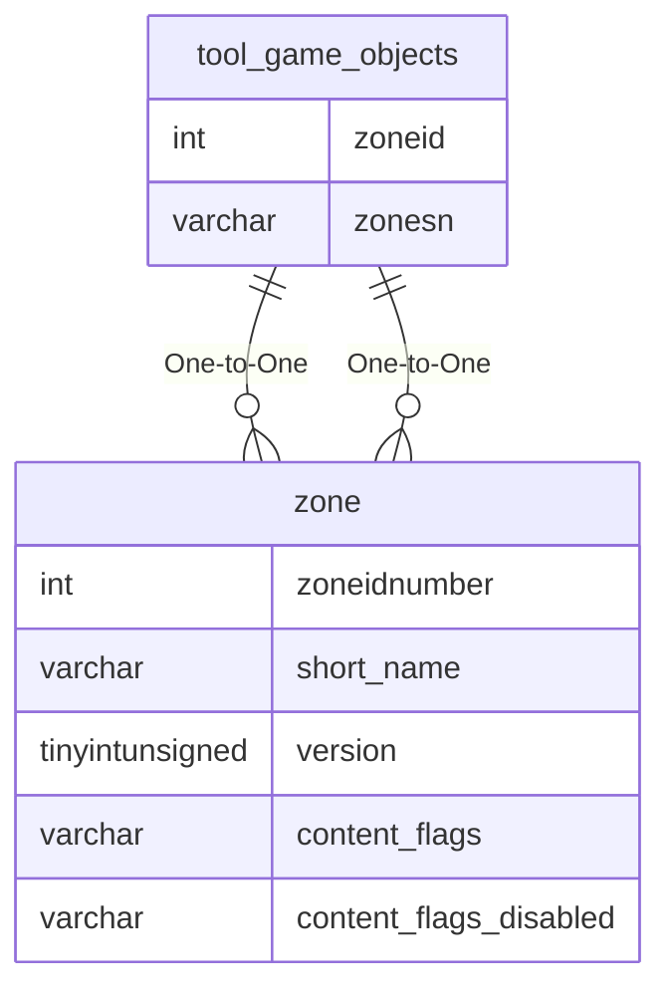

# tool_game_objects

!!! info
	This page was last generated 2024.02.07

## Relationship Diagram(s)

## Relationships

| Relationship Type | Local Key | Relates to Table | Foreign Key |
| :--- | :--- | :--- | :--- |
| One-to-One | zoneid | [zone](../../schema/zone/zone.md) | zoneidnumber |
| One-to-One | zonesn | [zone](../../schema/zone/zone.md) | short_name |

## Schema

| Column | Data Type | Description |
| :--- | :--- | :--- |
| id | int | Unique Tool Game Object Identifier |
| zoneid | int | [Zone Identifier](../../../../server/zones/zone-list) |
| zonesn | varchar | [Zone Short Name](../../../../server/zones/zone-list) |
| object_name | varchar | Object Name |
| file_from | varchar | File From |
| is_global | tinyint | Is Global: 0 = False, 1 = True |

