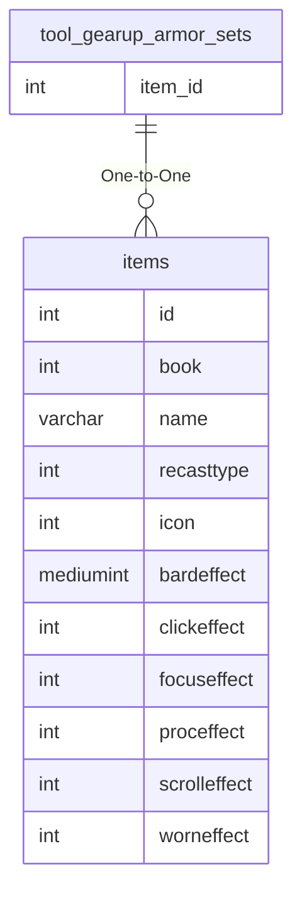

# tool_gearup_armor_sets

!!! info
	This page was last generated 2024.02.07

## Relationship Diagram(s)

## Relationships

| Relationship Type | Local Key | Relates to Table | Foreign Key |
| :--- | :--- | :--- | :--- |
| One-to-One | item_id | [items](../../schema/items/items.md) | id |

## Schema

| Column | Data Type | Description |
| :--- | :--- | :--- |
| class | tinyint | [Class](../../../../server/player/class-list) |
| level | smallint | Level |
| slot | tinyint | [Slot Identifier](../../../../server/inventory/inventory-slots) |
| item_id | int | [Item Identifier](../../schema/items/items.md) |
| score | mediumint | Score |
| expansion | tinyint | [Expansion](../../../../server/operation/expansion-list) |

