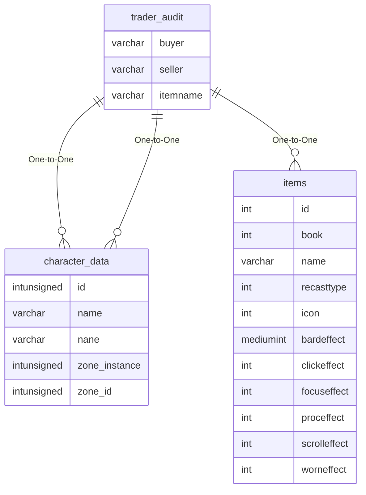

# trader_audit

## Relationships

| Relationship Type | Local Key | Relates to Table | Foreign Key |
| :--- | :--- | :--- | :--- |
| One-to-One | buyer | [character_data](../../schema/characters/character_data.md) | name |
| One-to-One | itemname | [items](../../schema/items/items.md) | name |
| One-to-One | seller | [character_data](../../schema/characters/character_data.md) | name |

## Schema

| Column | Data Type | Description |
| :--- | :--- | :--- |
| time | datetime | Time |
| seller | varchar | Seller |
| buyer | varchar | Buyer |
| itemname | varchar | [Item Name](../../schema/items/items.md) |
| quantity | int | Quantity |
| totalcost | int | Total Cost |
| trantype | tinyint | Transaction Type |

