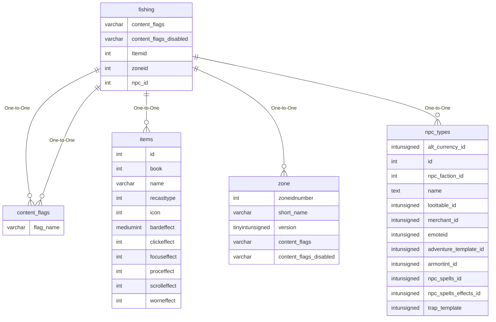

# fishing

!!! info
	This page was last generated 2024.02.07

## Relationship Diagram(s)

## Relationships

| Relationship Type | Local Key | Relates to Table | Foreign Key |
| :--- | :--- | :--- | :--- |
| One-to-One | content_flags | [content_flags](../../schema/flagging/content_flags.md) | flag_name |
| One-to-One | content_flags_disabled | [content_flags](../../schema/flagging/content_flags.md) | flag_name |
| One-to-One | Itemid | [items](../../schema/items/items.md) | id |
| One-to-One | zoneid | [zone](../../schema/zone/zone.md) | zoneidnumber |
| One-to-One | npc_id | [npc_types](../../schema/npcs/npc_types.md) | id |

## Schema

| Column | Data Type | Description |
| :--- | :--- | :--- |
| id | int | Unique Fishing Identifier |
| zoneid | int | [Zone Identifier](../../../../server/zones/zone-list) |
| Itemid | int | [Item Identifier](../../schema/items/items.md) |
| skill_level | smallint | Skill Level |
| chance | smallint | Chance: 0 = Never, 100 = Always |
| npc_id | int | [NPC Type Identifier](../../schema/npcs/npc_types.md) |
| npc_chance | int | NPC Chance: 0 = Never, 100 = Always |
| min_expansion | tinyint | [Minimum Expansion](../../../../server/operation/expansion-list) |
| max_expansion | tinyint | [Maximum Expansion](../../../../server/operation/expansion-list) |
| content_flags | varchar | Content Flags Required to be Enabled |
| content_flags_disabled | varchar | Content Flags Required to be Disabled |

