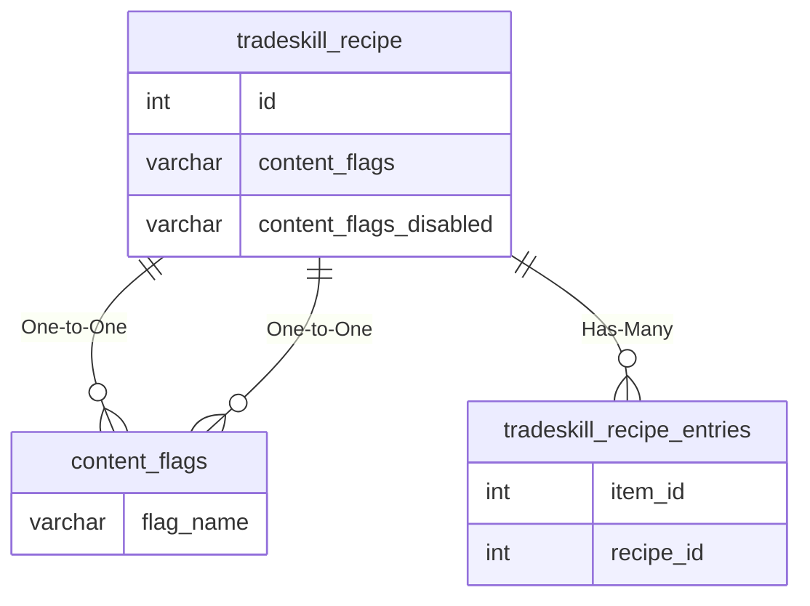

# tradeskill_recipe

## Relationships

| Relationship Type | Local Key | Relates to Table | Foreign Key |
| :--- | :--- | :--- | :--- |
| One-to-One | content_flags | [content_flags](../../schema/flagging/content_flags.md) | flag_name |
| One-to-One | content_flags_disabled | [content_flags](../../schema/flagging/content_flags.md) | flag_name |
| Has-Many | id | [tradeskill_recipe_entries](../../schema/tradeskills/tradeskill_recipe_entries.md) | recipe_id |

## Schema

| Column | Data Type | Description |
| :--- | :--- | :--- |
| id | int | Unique Tradeskill Recipe Identifier |
| name | varchar | Recipe Name |
| tradeskill | smallint | [Tradeskill](../../../../server/player/skills) |
| skillneeded | smallint | Skill Level Needed |
| trivial | smallint | Trivial Skill Level |
| nofail | tinyint | No Fail: 0 = False, 1 = True |
| replace_container | tinyint | Replace Container: 0 = False, 1 = True |
| notes | tinytext | Notes |
| must_learn | tinyint | Must Learn: 0 = False, 1 = True |
| learned_by_item_id | int |  |
| quest | tinyint | Quest Controlled: 0 = False, 1 = True |
| enabled | tinyint | Enabled: 0 = False, 1 = True |
| min_expansion | tinyint | [Minimum Expansion](../../../../server/operation/expansion-list) |
| max_expansion | tinyint | [Maximum Expansion](../../../../server/operation/expansion-list) |
| content_flags | varchar | Content Flags Required to be Enabled |
| content_flags_disabled | varchar | Content Flags Required to be Disabled |

