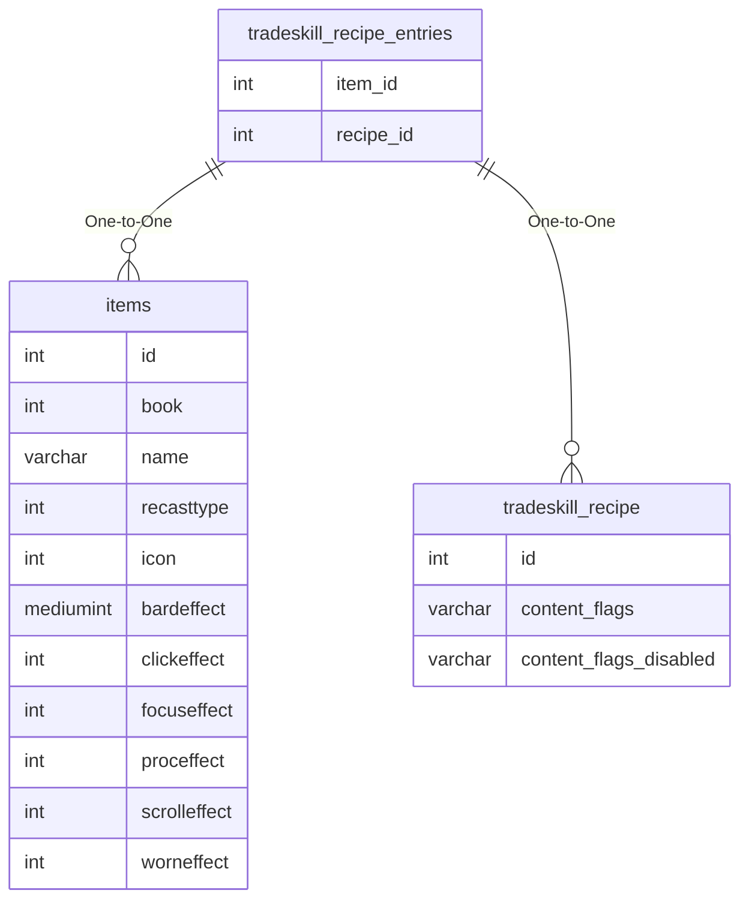

# tradeskill_recipe_entries

## Relationships

| Relationship Type | Local Key | Relates to Table | Foreign Key |
| :--- | :--- | :--- | :--- |
| One-to-One | item_id | [items](../../schema/items/items.md) | id |
| One-to-One | recipe_id | [tradeskill_recipe](../../schema/tradeskills/tradeskill_recipe.md) | id |

## Schema

| Column | Data Type | Description |
| :--- | :--- | :--- |
| id | int | Unique Tradeskill Recipe Entry Identifier |
| recipe_id | int | [Unique Tradeskill Recipe Identifier](tradeskill_recipe.md) |
| item_id | int | [Item Identifier](../../schema/items/items.md) |
| successcount | tinyint | Success Count |
| failcount | tinyint | Fail Count |
| componentcount | tinyint | Component Count |
| salvagecount | tinyint | Salvage Count |
| iscontainer | tinyint | Is Container: 0 = False, 1 = True |

