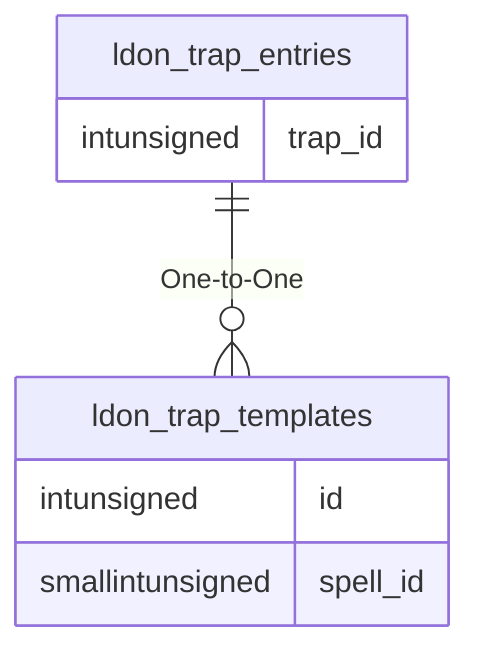

# ldon_trap_entries

!!! info
	This page was last generated 2024.02.07

## Relationship Diagram(s)

## Relationships

| Relationship Type | Local Key | Relates to Table | Foreign Key |
| :--- | :--- | :--- | :--- |
| One-to-One | trap_id | [ldon_trap_templates](../../schema/traps/ldon_trap_templates.md) | id |

## Schema

| Column | Data Type | Description |
| :--- | :--- | :--- |
| id | int | Unique LDoN Trap Entry Identifier |
| trap_id | int | [Trap Identifier](ldon_trap_templates.md) |

