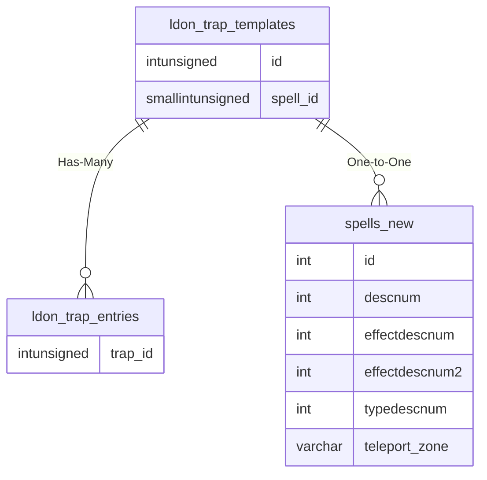

# ldon_trap_templates

## Relationships

| Relationship Type | Local Key | Relates to Table | Foreign Key |
| :--- | :--- | :--- | :--- |
| Has-Many | id | [ldon_trap_entries](../../schema/traps/ldon_trap_entries.md) | trap_id |
| One-to-One | spell_id | [spells_new](../../schema/spells/spells_new.md) | id |

## Schema

| Column | Data Type | Description |
| :--- | :--- | :--- |
| id | int | Unique LDoN Trap Template Identifier |
| type | tinyint | [Trap Type](../../../../server/zones/trap-types) |
| spell_id | smallint | [Spell Identifier](../../schema/spells/spells_new.md) |
| skill | smallint | [Skill](../../../../server/player/skills) |
| locked | tinyint | Locked: 0 = False, 1 = True |

