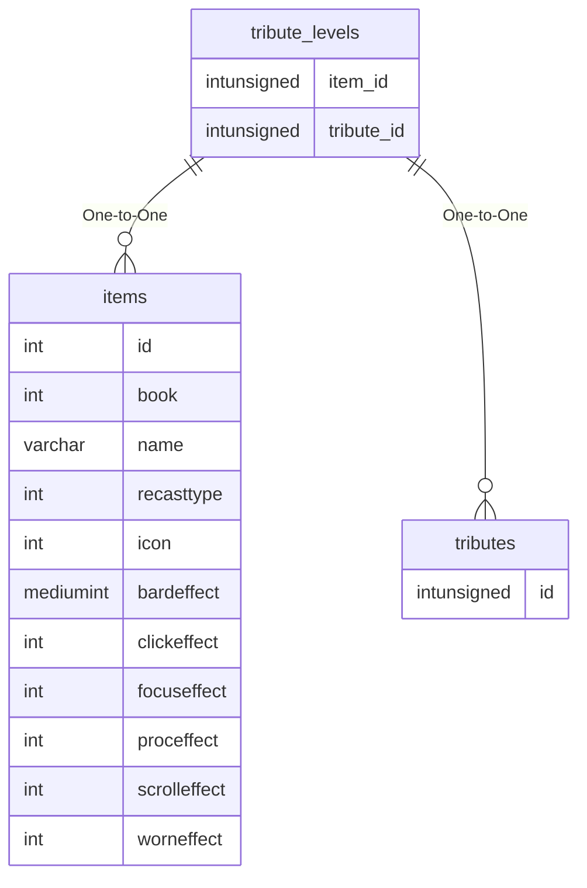

# tribute_levels

!!! info
	This page was last generated 2024.02.07

## Relationship Diagram(s)

## Relationships

| Relationship Type | Local Key | Relates to Table | Foreign Key |
| :--- | :--- | :--- | :--- |
| One-to-One | item_id | [items](../../schema/items/items.md) | id |
| One-to-One | tribute_id | [tributes](../../schema/tributes/tributes.md) | id |

## Schema

| Column | Data Type | Description |
| :--- | :--- | :--- |
| tribute_id | int | [Unique Tribute Identifier](tributes.md) |
| level | int | Level |
| cost | int | Cost |
| item_id | int | [Item Identifier](../../schema/items/items.md) |

