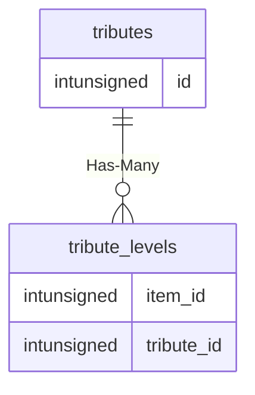

# tributes

## Relationships

| Relationship Type | Local Key | Relates to Table | Foreign Key |
| :--- | :--- | :--- | :--- |
| Has-Many | id | [tribute_levels](../../schema/tributes/tribute_levels.md) | tribute_id |

## Schema

| Column | Data Type | Description |
| :--- | :--- | :--- |
| id | int | Unique Tribute Identifier |
| unknown | int | Unknown |
| name | varchar | Name |
| descr | mediumtext | Description |
| isguild | tinyint | Is Guild: 0 = false, 1 = True |

