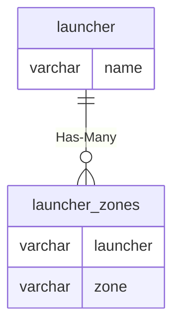

# launcher

## Relationships

| Relationship Type | Local Key | Relates to Table | Foreign Key |
| :--- | :--- | :--- | :--- |
| Has-Many | name | [launcher_zones](../../schema/zone/launcher_zones.md) | launcher |

## Schema

| Column | Data Type | Description |
| :--- | :--- | :--- |
| name | varchar | Name |
| dynamics | tinyint | Dynamics |

