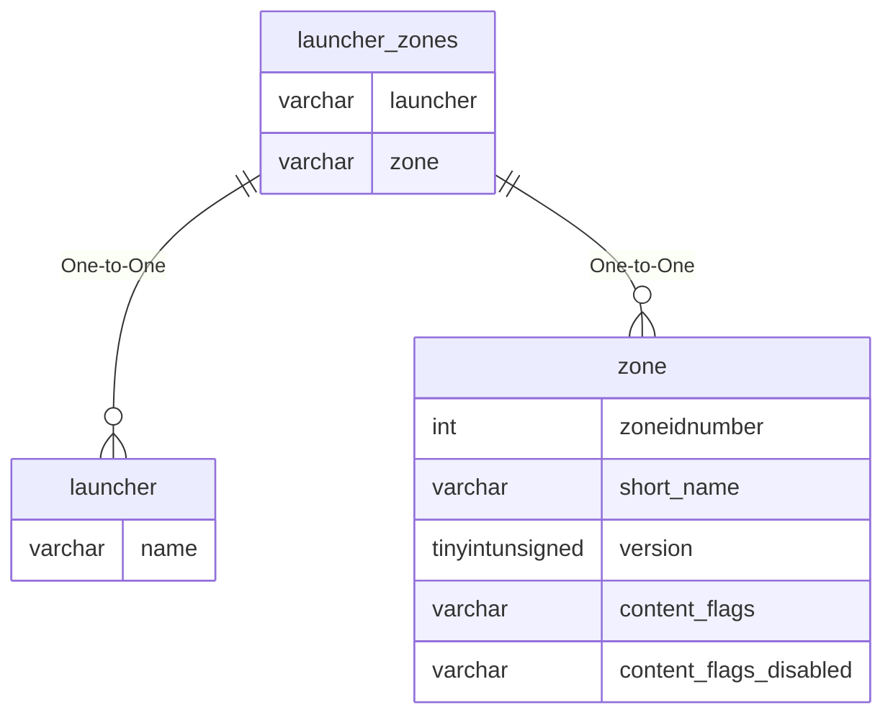

# launcher_zones

## Relationships

| Relationship Type | Local Key | Relates to Table | Foreign Key |
| :--- | :--- | :--- | :--- |
| One-to-One | launcher | [launcher](../../schema/zone/launcher.md) | name |
| One-to-One | zone | [zone](../../schema/zone/zone.md) | short_name |

## Schema

| Column | Data Type | Description |
| :--- | :--- | :--- |
| launcher | varchar | Launcher |
| zone | varchar | [Zone Short Name](../../../../server/zones/zone-list) |
| port | mediumint | Port |

