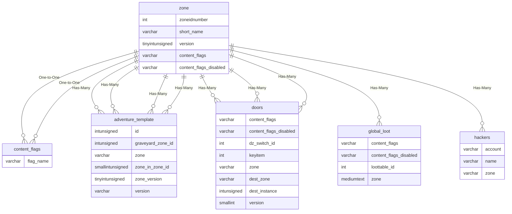
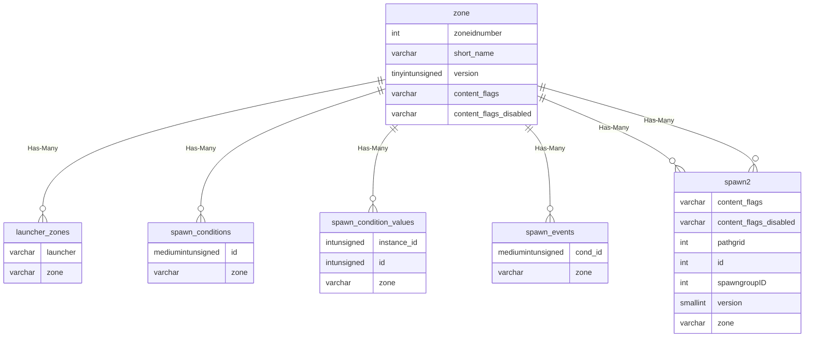
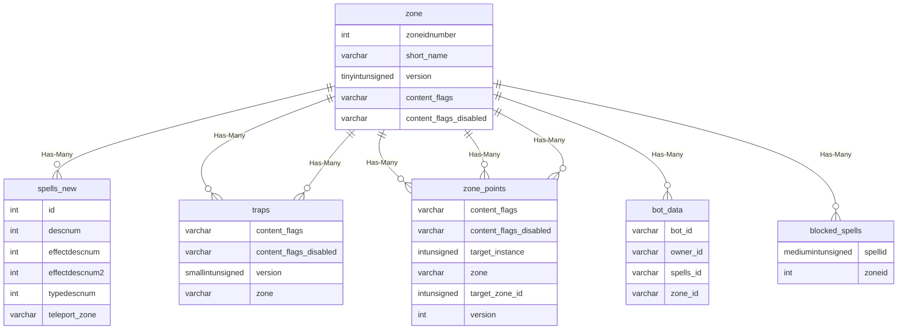
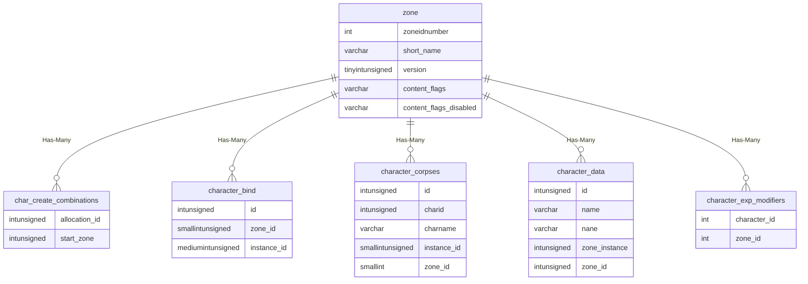
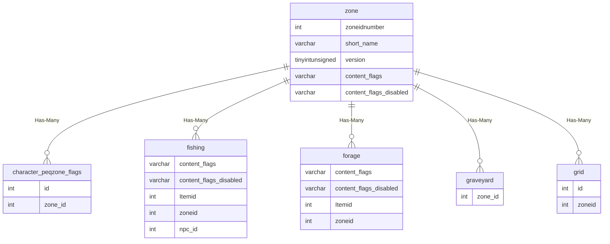
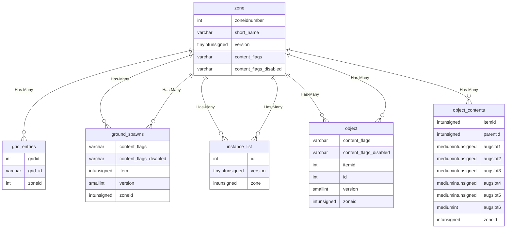
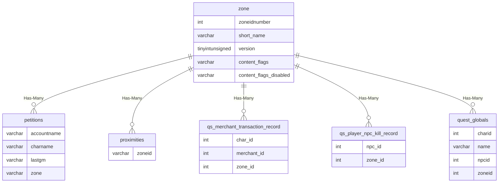
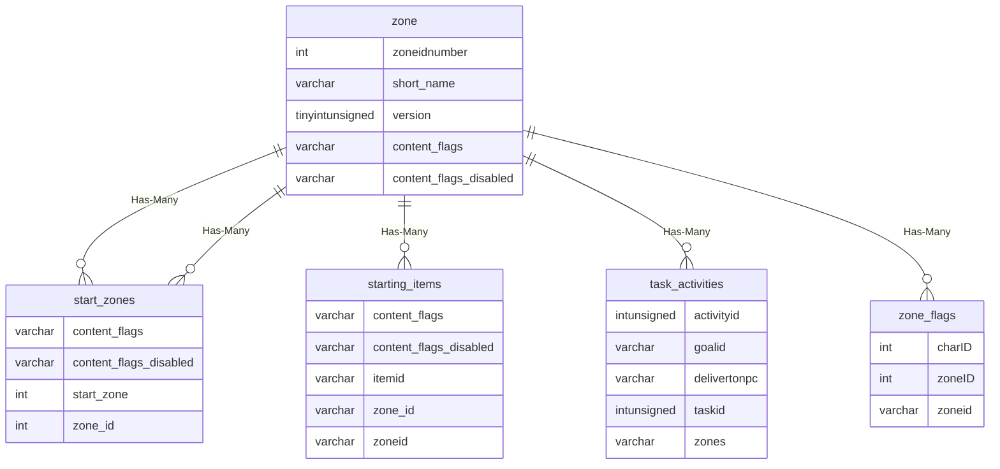

# zone

!!! info
	This page was last generated 2024.02.07

## Relationship Diagram(s)

## Relationships

| Relationship Type | Local Key | Relates to Table | Foreign Key |
| :--- | :--- | :--- | :--- |
| One-to-One | content_flags | [content_flags](../../schema/flagging/content_flags.md) | flag_name |
| One-to-One | content_flags_disabled | [content_flags](../../schema/flagging/content_flags.md) | flag_name |
| Has-Many | short_name | [adventure_template](../../schema/adventures/adventure_template.md) | zone |
| Has-Many | short_name | [doors](../../schema/doors/doors.md) | zone |
| Has-Many | short_name | [doors](../../schema/doors/doors.md) | dest_zone |
| Has-Many | short_name | [global_loot](../../schema/loot/global_loot.md) | zone |
| Has-Many | short_name | [hackers](../../schema/admin/hackers.md) | zone |
| Has-Many | short_name | [launcher_zones](../../schema/zone/launcher_zones.md) | zone |
| Has-Many | short_name | [spawn_conditions](../../schema/spawns/spawn_conditions.md) | zone |
| Has-Many | short_name | [spawn_condition_values](../../schema/spawns/spawn_condition_values.md) | zone |
| Has-Many | short_name | [spawn_events](../../schema/spawns/spawn_events.md) | zone |
| Has-Many | short_name | [spawn2](../../schema/spawns/spawn2.md) | zone |
| Has-Many | short_name | [spells_new](../../schema/spells/spells_new.md) | teleport_zone |
| Has-Many | short_name | [traps](../../schema/traps/traps.md) | zone |
| Has-Many | short_name | [zone_points](../../schema/zone/zone_points.md) | zone |
| Has-Many | zoneidnumber | [adventure_template](../../schema/adventures/adventure_template.md) | graveyard_zone_id |
| Has-Many | zoneidnumber | [adventure_template](../../schema/adventures/adventure_template.md) | zone_in_zone_id |
| Has-Many | zoneidnumber | [bot_data](../../schema/bots/bot_data.md) | zone_id |
| Has-Many | zoneidnumber | [blocked_spells](../../schema/spells/blocked_spells.md) | zoneid |
| Has-Many | zoneidnumber | [char_create_combinations](../../schema/characters/char_create_combinations.md) | start_zone |
| Has-Many | zoneidnumber | [character_bind](../../schema/characters/character_bind.md) | zone_id |
| Has-Many | zoneidnumber | [character_corpses](../../schema/characters/character_corpses.md) | zone_id |
| Has-Many | zoneidnumber | [character_data](../../schema/characters/character_data.md) | zone_id |
| Has-Many | zoneidnumber | [character_exp_modifiers](../../schema/characters/character_exp_modifiers.md) | zone_id |
| Has-Many | zoneidnumber | [character_peqzone_flags](../../schema/characters/character_peqzone_flags.md) | zone_id |
| Has-Many | zoneidnumber | [fishing](../../schema/tradeskills/fishing.md) | zoneid |
| Has-Many | zoneidnumber | [forage](../../schema/tradeskills/forage.md) | zoneid |
| Has-Many | zoneidnumber | [graveyard](../../schema/graveyards/graveyard.md) | zone_id |
| Has-Many | zoneidnumber | [grid](../../schema/grids/grid.md) | zoneid |
| Has-Many | zoneidnumber | [grid_entries](../../schema/grids/grid_entries.md) | zoneid |
| Has-Many | zoneidnumber | [ground_spawns](../../schema/ground-spawns/ground_spawns.md) | zoneid |
| Has-Many | zoneidnumber | [instance_list](../../schema/instances/instance_list.md) | zone |
| Has-Many | zoneidnumber | [object](../../schema/objects/object.md) | zoneid |
| Has-Many | zoneidnumber | [object_contents](../../schema/objects/object_contents.md) | zoneid |
| Has-Many | zoneidnumber | [petitions](../../schema/admin/petitions.md) | zone |
| Has-Many | zoneidnumber | [proximities](../../schema/npcs/proximities.md) | zoneid |
| Has-Many | zoneidnumber | [qs_merchant_transaction_record](../../schema/query-server/qs_merchant_transaction_record.md) | zone_id |
| Has-Many | zoneidnumber | [qs_player_npc_kill_record](../../schema/query-server/qs_player_npc_kill_record.md) | zone_id |
| Has-Many | zoneidnumber | [quest_globals](../../schema/data-storage/quest_globals.md) | zoneid |
| Has-Many | zoneidnumber | [start_zones](../../schema/admin/start_zones.md) | zone_id |
| Has-Many | zoneidnumber | [start_zones](../../schema/admin/start_zones.md) | start_zone |
| Has-Many | zoneidnumber | [starting_items](../../schema/admin/starting_items.md) | zoneid |
| Has-Many | zoneidnumber | [task_activities](../../schema/tasks/task_activities.md) | zones |
| Has-Many | zoneidnumber | [zone_flags](../../schema/zone/zone_flags.md) | zoneID |
| Has-Many | zoneidnumber | [zone_points](../../schema/zone/zone_points.md) | target_zone_id |
| Has-Many | version | [adventure_template](../../schema/adventures/adventure_template.md) | version |
| Has-Many | version | [doors](../../schema/doors/doors.md) | version |
| Has-Many | version | [ground_spawns](../../schema/ground-spawns/ground_spawns.md) | version |
| Has-Many | version | [instance_list](../../schema/instances/instance_list.md) | version |
| Has-Many | version | [object](../../schema/objects/object.md) | version |
| Has-Many | version | [spawn2](../../schema/spawns/spawn2.md) | version |
| Has-Many | version | [traps](../../schema/traps/traps.md) | version |
| Has-Many | version | [zone_points](../../schema/zone/zone_points.md) | version |

## Schema

| Column | Data Type | Description |
| :--- | :--- | :--- |
| short_name | varchar | Short Name |
| id | int | Unique Entry Identifier |
| file_name | varchar | File Name |
| long_name | text | Long Name |
| map_file_name | varchar | Map File Name |
| safe_x | float | Safe X Coordinate |
| safe_y | float | Safe Y Coordinate |
| safe_z | float | Safe Z Coordinate |
| safe_heading | float | Safe Heading Coordinate |
| graveyard_id | float | [Graveyard Identifier](../../schema/graveyards/graveyard.md) |
| min_level | tinyint | Minimum Level |
| max_level | tinyint | Maximum Level |
| min_status | tinyint | [Minimum Status](../../../../server/player/status-levels) |
| zoneidnumber | int | [Unique Zone Identifier](../../../../server/zones/zone-list) |
| version | tinyint | Version |
| timezone | int | Timezone |
| maxclients | int | Maximum Clients |
| ruleset | int | [Ruleset Identifier](../../schema/rules/rule_sets.md) |
| note | varchar | Note |
| underworld | float | Bottom Z to represent when the player is under the world |
| minclip | float | Minimum Clipping Distance |
| maxclip | float | Maximum Clipping Distance |
| fog_minclip | float | Fog Minimum Clipping Distance |
| fog_maxclip | float | Fog Maximum Clipping Distance |
| fog_blue | tinyint | Fog Blue Level: 0 = None, 255 = Max |
| fog_red | tinyint | Fog Red Level: 0 = None, 255 = Max |
| fog_green | tinyint | Fog Green Level: 0 = None, 255 = Max |
| sky | tinyint | Sky type the client will present as the backdrop |
| ztype | tinyint | This field is sent directly to the client on zone-in, most zones are set to 0, 1 or 255. |
| zone_exp_multiplier | decimal | This will multiply the XP to this percentage value (decimal based, 100% = 1.0) |
| walkspeed | float | Walkspeed in this zone |
| time_type | tinyint | This value varies depending on the zone but it is sent to the client on zone in.  Most starting zones/newbie areas have this value set to 2, dungeons tyically have this set to 0, some zones break from the norm and have values greater than 2, (akanon = 3, blackburrow = 5, cazicthule = 5, crushbone = 5, erudnint = 4, kaladima = 3, etc.) |
| fog_red1 | tinyint | Fog Red Level 1: 0 = None, 255 = Max |
| fog_green1 | tinyint | Fog Green Level 1: 0 = None, 255 = Max |
| fog_blue1 | tinyint | Fog Blue Level 1: 0 = None, 255 = Max |
| fog_minclip1 | float | Fog Minimum Clipping Distance 1 |
| fog_maxclip1 | float | Fog Maximum Clipping Distance 1 |
| fog_red2 | tinyint | Fog Red Level 2: 0 = None, 255 = Max |
| fog_green2 | tinyint | Fog Green Level 2: 0 = None, 255 = Max |
| fog_blue2 | tinyint | Fog Blue Level 2: 0 = None, 255 = Max |
| fog_minclip2 | float | Fog Minimum Clipping Distance 2 |
| fog_maxclip2 | float | Fog Maximum Clipping Distance 2 |
| fog_red3 | tinyint | Fog Red Level 3: 0 = None, 255 = Max |
| fog_green3 | tinyint | Fog Green Level 3: 0 = None, 255 = Max |
| fog_blue3 | tinyint | Fog Blue Level 3: 0 = None, 255 = Max |
| fog_minclip3 | float | Fog Minimum Clipping Distance 3 |
| fog_maxclip3 | float | Fog Maximum Clipping Distance 4 |
| fog_red4 | tinyint | Fog Red Level 4: 0 = None, 255 = Max |
| fog_green4 | tinyint | Fog Green Level 4: 0 = None, 255 = Max |
| fog_blue4 | tinyint | Fog Blue Level 4: 0 = None, 255 = Max |
| fog_minclip4 | float | Fog Minimum Clipping Distance 4 |
| fog_maxclip4 | float | Fog Maximum Clipping Distance 4 |
| fog_density | float | This is the intensity of the fog, this should be a number between 0-1, most commonly used is .1 or .33 |
| flag_needed | varchar | [Flag Required](zone_flags.md) |
| bucket_name | varchar |  |
| cancombat | tinyint | Can Combat: 0 = False, 1 = True |
| canlevitate | tinyint | Can Levitate: 0 = False, 1 = True (Does not affect those with #gm on) |
| castoutdoor | tinyint | Cast Outdoors: 0 = False, 1 = True |
| hotzone | tinyint | Hotzone: 0 = False, 1 = True |
| insttype | tinyint | Instance Type |
| shutdowndelay | bigint | Shutdown Delay |
| peqzone | tinyint | #peqzone: 0 = False, 1 = True |
| expansion | tinyint | [Expansion](../../../../server/operation/expansion-list) |
| bypass_expansion_check | tinyint | Bypass Expansion Check: 0 = False, 1 = True |
| suspendbuffs | tinyint | Suspend Buffs: 0 = False, 1 = True |
| rain_chance1 | int | Rain Chance 1 |
| rain_chance2 | int | Rain Chance 2 |
| rain_chance3 | int | Rain Chance 3 |
| rain_chance4 | int | Rain Chance 4 |
| rain_duration1 | int | Rain Duration 1 |
| rain_duration2 | int | Rain Duration 2 |
| rain_duration3 | int | Rain Duration 3 |
| rain_duration4 | int | Rain Duration 4 |
| snow_chance1 | int | Snow Chance 1 |
| snow_chance2 | int | Snow Chance 2 |
| snow_chance3 | int | Snow Chance 3 |
| snow_chance4 | int | Snow Chance 4 |
| snow_duration1 | int | Snow Duration 1 |
| snow_duration2 | int | Snow Duration 2 |
| snow_duration3 | int | Snow Duration 3 |
| snow_duration4 | int | Snow Duration 4 |
| gravity | float | Gravity |
| type | int | Type (0 = Unknown, 1 = Regular, 2 = Instanced, 3 = Hybrid, 4 = Raid, 5 = City) |
| skylock | tinyint | Sky Lock |
| fast_regen_hp | int | Fast Regen Health |
| fast_regen_mana | int | Fast Regen Mana |
| fast_regen_endurance | int | Fast Regen Endurance |
| npc_max_aggro_dist | int | NPC Max Aggro Distance |
| max_movement_update_range | int | Max Movement Update Range |
| min_expansion | tinyint | [Minimum Expansion](../../../../server/operation/expansion-list) |
| max_expansion | tinyint | [Maximum Expansion](../../../../server/operation/expansion-list) |
| content_flags | varchar | Content Flags Required to be Enabled |
| content_flags_disabled | varchar | Content Flags Required to be Disabled |
| underworld_teleport_index | int | Underworld Teleport Index |
| lava_damage | int | Lava Damage Modifier |
| min_lava_damage | int | Minimum Lava Damage Modifier |
| idle_when_empty | tinyint |  |
| seconds_before_idle | int |  |

