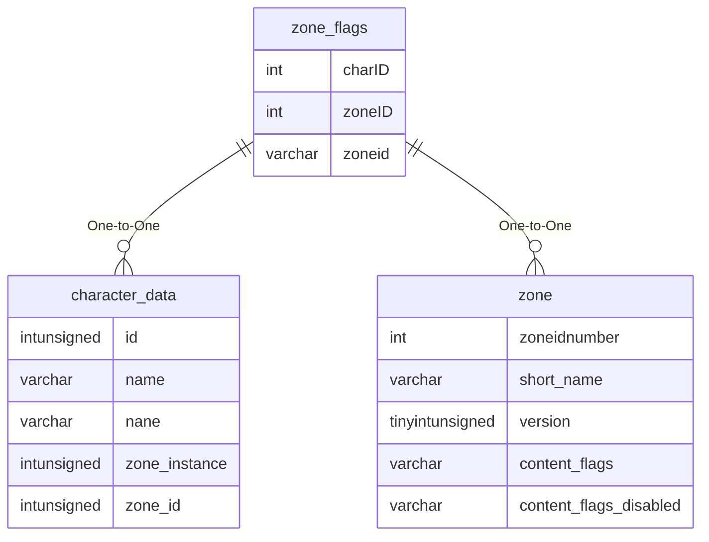

# zone_flags

## Relationships

| Relationship Type | Local Key | Relates to Table | Foreign Key |
| :--- | :--- | :--- | :--- |
| One-to-One | charID | [character_data](../../schema/characters/character_data.md) | id |
| One-to-One | zoneid | [zone](../../schema/zone/zone.md) | zoneidnumber |

## Schema

| Column | Data Type | Description |
| :--- | :--- | :--- |
| charID | int | [Unique Character Identifier](../../schema/characters/character_data) |
| zoneID | int | [Zone Identifier](../../../../server/zones/zone-list) |

