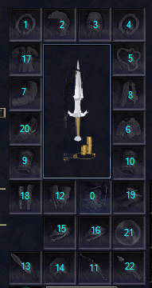

# Inventory Slots

### Equipment Slots (Worn)

!!! example

    !!! Slots inline

        | Slot      | # |
        | ----------- | ----------- |
        | Charm|  0 |
        | Ear1|  1 |
        | Head|  2 |
        | Face|  3 |
        | Ear2|  4 |
        | Neck|  5 |
        | Shoulders|  6 |
        | Arms|  7 |
        | Back|  8 |
        | Wrist1|  9 |
        | Wrist2 | 10 |
        | Range | 11 |
        | Hands | 12 |
        | Primary | 13 |
        | Secondary | 14 |
        | Finger1 | 15 |
        | Finger2 | 16 |
        | Chest | 17 |
        | Legs | 18 |
        | Feet | 19 |
        | Waist | 20 |
        | PowerSource | 21 |
        | Ammo | 22 |

    

### General Slots (Personal)

!!! example

        !!! Slots inline

            Bag slots in general inventory are

            | Slot      | # |
            | ----------- | ----------- |
            | General1 | 23 |
            | General2 | 24 |
            | General3 | 25 |
            | General4 | 26 |
            | General5 | 27 |
            | General6 | 28 |
            | General7 | 29 |
            | General8 | 30 |
            | General9 | 31 |
            | General10 | 32 |

    

### Cursor Slot(s)

| Slot      | # |
| ----------- | ----------- |
| Cursor | 33 |
| Cursor Bag Slots | 6010 -> 6209 |

### Tribute

| Slot      | # |
| ----------- | ----------- |
| Cursor Bag Slots | 400 -> 404 |

Tribute items are slots 400 -&gt; 404, these items are not visible, but are counted for stats/effects.

### Bank

Bank slots are 2000 -> 2023

Bags in the bank are


| Base Slot      | Range |
| ----------- | ----------- |
| 2000 | 6210 -> 6409 |
| 2001 | 6410 -> 6609 |
| 2002 | 6610 -> 6809 |
| 2003 | 6810 -> 7009 |
| 2004 | 7010 -> 7209 |
| 2005 | 7210 -> 7409 |
| 2006 | 7410 -> 7609 |
| 2007 | 7610 -> 7809 |
| 2008 | 7810 -> 8009 |
| 2009 | 8010 -> 8209 |
| 2010 | 8210 -> 8409 |
| 2011 | 8410 -> 8609 |
| 2012 | 8610 -> 8809 |
| 2013 | 8810 -> 9009 |
| 2014 | 9010 -> 9209 |
| 2015 | 9210 -> 9409 |
| 2016 | 9410 -> 9609 |
| 2017 | 9610 -> 9809 |
| 2018 | 9810 -> 10009 |
| 2019 | 10010 -> 10209 |
| 2020 | 10210 -> 10409 |
| 2021 | 10410 -> 10609 |
| 2022 | 10610 -> 10809 |
| 2023 | 10810 -> 11009 |

#### Shared Bank

Shared bank slots are 2500 and 2501

!!! note

    These are stored in the sharedbank table, not the inventory table.

Bags in the shared bank are

| Base Slot      | Range |
| ----------- | ----------- |
| 2500 | 11010 -> 11209 |
| 2501 | 11210 -> 11409 |


!!! note

    Not all clients support all of the server-recognized slots. Care should be taken when attempting to hard-code slot values over the use of server-based free slot requests. For example, 200-slot bags are only supported on RoF2 at this time.

#### Quest-Use Reference

!!! info

    === "Perl"

        ### Examples
        
        ```perl
        quest::getinventoryslotid("cursor"); # returns current cursor slot definition
        quest::getinventoryslotid("general.begin"); # returns current general slot beginning definition
        quest::getinventoryslotid("augsocket.end"); # returns current augment socket end definition
        ```

        ### Identifier tokens <a id="user-content-identifier-tokens"></a>
        
        ```text
        "charm"
        "ear1"
        "head"
        "face"
        "ear2"
        "neck"
        "shoulders"
        "arms"
        "back"
        "wrist1"
        "wrist2"
        "range"
        "hands"
        "primary"
        "secondary"
        "finger1"
        "finger2"
        "chest"
        "legs"
        "feet"
        "waist"
        "powersource"
        "ammo"
        "general1"
        "general2"
        "general3"
        "general4"
        "general5"
        "general6"
        "general7"
        "general8"
        "general9"
        "general10"
        "cursor"
        "possessions.begin"
        "possessions.end"
        "equipment.begin"
        "equipment.end"
        "general.begin"
        "general.end"
        "generalbags.begin"
        "generalbags.end"
        "cursorbag.begin"
        "cursorbag.end"
        ~"tradeskill" (not implemented in perl)
        ~"augment" (not implemented in perl)
        "bank.begin"
        "bank.end"
        "bankbags.begin"
        "bankbags.end"
        "sharedbank.begin"
        "sharedbank.end"
        "sharedbankbags.begin"
        "sharedbankbags.end"
        "bagslot.begin"
        "bagslot.end"
        "augsocket.begin"
        "augsocket.end"
        "invalid"
        ```

## Developer Information on Client-Specific Slot Support

### SoF Slots Equipped slots

| Slot      | # |
| ----------- | ----------- |
| SLOT_CHARM |  0 |
| SLOT_EAR01 |  1 |
| SLOT_HEAD |  2 |
| SLOT_FACE |  3 |
| SLOT_EAR02 |  4 |
| SLOT_NECK |  5 |
| SLOT_SHOULDER |  6 |
| SLOT_ARMS |  7 |
| SLOT_BACK |  8 |
| SLOT_BRACER01 |  9 |
| SLOT_BRACER02 | 10 |
| SLOT_RANGE | 11 |
| SLOT_HANDS | 12 |
| SLOT_PRIMARY | 13 |
| SLOT_SECONDARY | 14 |
| SLOT_RING01 | 15 |
| SLOT_RING02 | 16 |
| SLOT_CHEST | 17 |
| SLOT_LEGS | 18 |
| SLOT_FEET | 19 |
| SLOT_WAIST | 20 |
| SLOT_POWERSOURCE | 21 |
| SLOT_AMMO | 22 |

## Inventory Slots

NOTE: Numbering for personal inventory goes top to bottom, then left to right

It's the opposite for inside bags: left to right, then top to bottom

Example:

inventory:containers:

* 1 51 2
* 2 63 4
* 3 75 6
* 4 87 8
*   9 10

#### Personal Inventory

Personal inventory slots 23 through 30.

Bags in personal inventory are:

* 23: 262-&gt;271
* 24: 272-&gt;281
* 25: 282-&gt;291
* 26: 292-&gt;301
* 27: 302-&gt;311
* 28: 312-&gt;321
* 29: 322-&gt;331
* 30: 332-&gt;341

#### Cursor

Cursor is slot 31, and the bag slots for the cursor are 342-&gt;351 (haven't confirmed slots inside bag on cursor for SoF yet).

#### SoF Bank

Bank slots in SoF are 2000-&gt;2023

Bags in the bank are:

* 2000 2004 2008 2012 2016 2020
* 2001 2005 2009 2013 2017 2021
* 2002 2006 2010 2014 2018 2022
* 2003 2007 2011 2015 2019 2023

Slots inside those bags are:

Note: Other than the addition of the 8 new slots, the main bank slots are the same as Titanium, but slots inside bags are +1 to what Titanium uses.

* 2000 = 2032 - 2041
* 2001 = 2042 - 2051
* 2002 = 2052 - 2061
* 2003 = 2062 - 2071
* 2004 = 2072 - 2061
* 2005 = 2082 - 2091
* 2006 = 2092 - 2101
* 2007 = 2102 - 2111
* 2008 = 2112 - 2121
* 2009 = 2122 - 2131
* 2010 = 2132 - 2141
* 2011 = 2142 - 2151
* 2012 = 2152 - 2161
* 2013 = 2162 - 2171
* 2014 = 2172 - 2181
* 2015 = 2182 - 2191
* 8 New Bank Slots:
* 2016 = 2192 - 2201
* 2017 = 2202 - 2211
* 2018 = 2212 - 2221
* 2019 = 2222 - 2231
* 2020 = 2232 - 2241
* 2021 = 2242 - 2251
* 2022 = 2252 - 2261
* 2023 = 2262 - 2271

#### SoF Shared Bank

Shared bank slots in SoF are 2500 and 2501

Note: These are the same as in Titanium, but the slots for inside bags are +1 to the ones in Titanium

Bags in the shared bank are:

* 2500 = 2532 - 2541
* 2501 = 2542 - 2551

