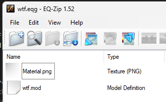

!!! info
  This is an advanced guide. You should be familiar with the basics of EQEmu before attempting this guide.

Here are the blockers you need to overcome to create a custom race:

- [Create a custom race model](#create-a-custom-race-model)
- [Inject a new model name to eqgame](#inject-a-new-model-name-to-eqgame)
- [Increase max race ID server side](#increase-max-race-id-server-side)
- [Add the new Race to either global or zone loading](#add-the-new-Race-to-either-global-or-zone-loading)
- [Spawn the new race in game](#spawn-the-new-race-in-game)

# Create a custom race model

There are currently a number of ways to do this, and each one has it's pros and cons. 

- [Quail](#create-model-via-quail): This route is potentially easiest, but as of this doc writing is still buggy.
- [EQGZI](#create-model-via-eqgzi): This route is made for zones, and can be used with a convuluted process to get a .mod file out of the generated content and prepare to the final steps noted on this section. This is not recommended.
- EQModelImporter: This process is not documented yet

## Create model via Quail

- Download [Blender](https://www.blender.org/download/)
- Download [Quail-Addon zip](https://github.com/xackery/quail-addon/releases)
- Install Blender
- Open Blender
- Go to Edit -> Preferences -> Addons -> Install
- Select the quail-addon zip file
- Enable the Quail addon
- Press `n` to open the right side panel
- A fast export menu should appear. Type in the field wtf.eqg 
- Create a cube by pressing shift+a -> mesh -> cube
- Click the EverQuest tab
- Click File -> Save As, and place the blend file in your EQ directory, call it e.g. wtf.blend
- Press the fast export button. A pop up should appear with success: 

## Create model via EQGZI

Not yet documented

# Inject a new model name to eqgame

Adding new model names is not easily exposed. You need to do a client side edit to inject it, unfortunately. Some ways to achieve this include:

- Edit the eqgame.exe directly (not documented yet)
- Add a dll hook to inject the new Races via dinput8.dll (recommended)

To inject the new Races via dinput8.dll, one of the easier routes is to use [eq-core-dll](https://github.com/xackery/eq-core-dll). The setup process for this is on the README of the link, follow the steps, contact the discord on eqemu if any help, a number of folks are familiar with the process.

From now on, we're going to continue the wiki with the shortname of `WTF` and race ID of `733`, which is the next unused ID for RoF2 by default.


Once set up, inside `_options.h` you want to add the new `race shortname` and new `unique ID`, similar to this:

```cpp
// areCustomRacesEnabled if set to true will allow the Races defined in Races[] to be injected in game
bool areCustomRacesEnabled = false;

// Race Entry:
// raceID is the index. If it's a new Race, start at 733. You'll need to update the rule Race:MaxRaceID
// GenderID ranges from 0 to 2 usually
// modelName is the race's shortname tag
// raceMask is a range of flags, typically using 8 is safe for most Races, but e.g. 1 = drivable boat, 2 = ridable boat, etc
// dbStrID if left to 1 reverts to raceID as it's ID, otherwise you can custom set one, and it'll look up dbStr for info
static RaceEntry Races[] = {
    // raceID, genderID, modelName, raceMask, dbStrID
    RaceEntry(733, 2, "WTF", 3, 1),
};
```

Change `areCustomRacesEnabled` to `true`, and add your new race entry to the list. You can add as many as you want, but you'll need to update the `MaxRaceID` rule later to match the highest raceID you use.

If you're curious what existing NPCs use for race flags, [this gist covers them](https://gist.github.com/xackery/f39d14b93004dae295e861f387a7374e){:target="_blank"}

Once you build the solution, copy the generated `dinput8.dll`` to your EQ directory and you've now injected a new model name to eqgame.

# Increase max race ID server side

This step requires you to edit the rules table. You can do this via spire, peq editor, database, or via the server console. I'll assume you've played enough with eqemu to know how to edit rules already, so the changes are:

- Edit Race:MaxRaceID from 732 to your new value, 733, or higher if you added more than one Race
- Reload rules in game via #reload rule

# Add the new Race to either global or zone loading

Races aren't loaded by default until a txt file informs EQ to do so. The easiest routes to add a custom NPC are either via global race and zone race entries. Both are covered below.

## Global Race
- Inside your eq directory, go to the Resources subfolder and look for GlobalLoad_chr.txt
- On the first line, you'll see a number such as 13 by default. This is a count of how many elements follow to load. Since we're adding 1 Race, change this to 14 (or increase based on the number you have already)
- On the last line, add your new Race. It should look like this: `wtf, wtf`

## Zone Race
- Inside your eq directory, go to the root folder and look for a your zonename.eqg. There should be also a zonename_chr.txt. Edit it, and on top line will be the number of elements to load, increase it by one. On the last line, add your new Race. It should look like this: `wtf, wtf`

# Spawn the new race in game

The easiest way to spawn to test is go to a zone it loads in (or any zone if you used a global race) and type `#spawn WTF 733 1 0 10 2`. This will spawn an Race named WTF with race ID 733, level 1, and gender 2 (neutral).

# Troubleshooting

If you generated your .mod file in a unique way, here's a screenshot of the contents of my wtf.mod:


