# Using the PEQ Database Editing Interface

## The NPC Tab

Once you have logged into your PEQ Editor, click on the NPCs tab.  Here you will have the opportunity to select the desired zone, interrogate the data for existing NPCs, or explore NPC-related information, such as emotes and auras.

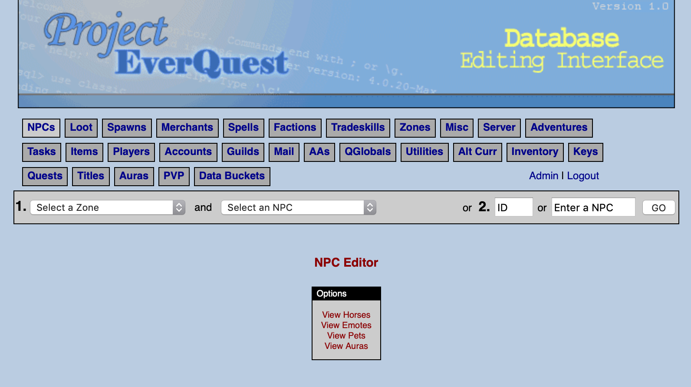

### Select A Zone

Your NPC will be create under a particular zone.  Note that while you can spawn your NPC in other zones, you should pay careful attention to the available models, as an NPC will appear as a Human Male if the client does not support a particular model in a particular zone (client customization for model support is a different topic).

We will work on creating an NPC in the Tutorial (tutorialb).  Select the tutorialb from the zone list pull-down:

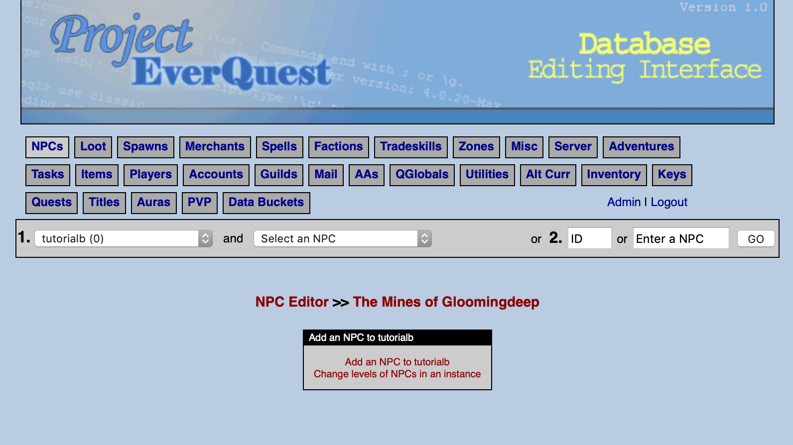

### Choose the "Add an NPC to tutorialb" option

When you click the _Add an NPC to tutorialb_ option, you will first have to assign a level to the NPC.  Assigning a level sets default parameters for Hitpoints, mana, AC, etc.

For the purposes of this guide, we are creating a server greeter NPC.  Let's assign level 1 and continue.


### Select the NPC attributes

A dazzling array of NPC attributes are displayed on the page.  These attributes all correspond to the fields in the database where your NPC is stored.  Note that many fields have been populated based on your choice of level, as well as the NPC ID--which is the next available ID in your database.  Note that your values may be slightly different than the screenshot.

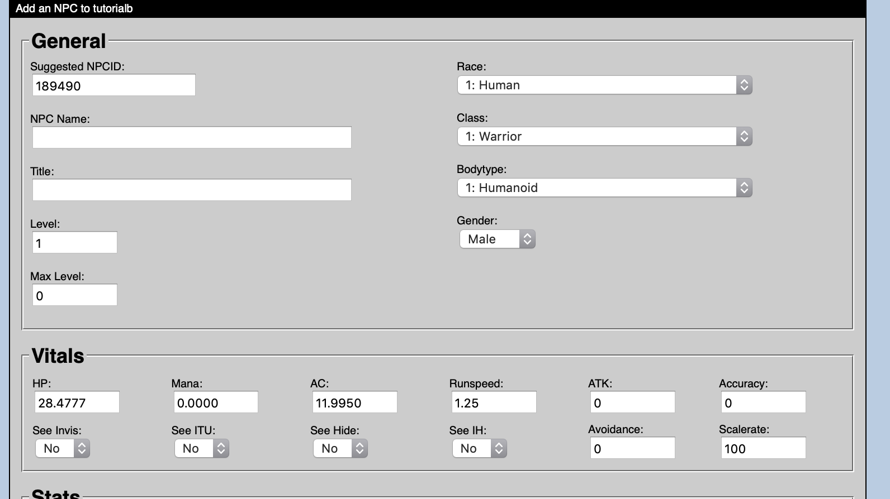

Explanations for each of these fields can be found on the [npc_types](/schema/npcs/npc_types.md) page (opens new window) in the Database Schema documentation.  

For our Server Greeter Bot, we are going to input the NPC Name as "_**Salutation_Model_XIV**_", select the **457 - Gnomework** _race_, with a **5 - Construct** _bodytype_ setting, _gender_ **Neuter**. These options will cause the NPC to display correctly to the client.  Be sure to also place a checkmark in the following boxes:  **Will Not Aggro (24)**, **Immune to Aggro (25)**, and **Has Quest File**.  The rest of the settings are entirely up to you.  You can choose to match the settings below for the purposes of this guide.  We do want our Greeter Bot to be noticeable, so we have increased the _size_ to **10**.  We also don't want our Greeter Bot to be accidentally killed, so we have made the NPC quite resilient by granting ridiculous HP and resist.  

.jpg>)

### Review your NPC

Once you submit your selections, you can review the settings of your NPC.  Note the "Is Quest NPC" indicator below the NPC Name.  This indicates that this NPC will have an associated quest script, and was caused by our selection of the **Has Quest File** checkbox in the previous step.  Clicking this link allows you to view (not edit) the quest script for the NPC.

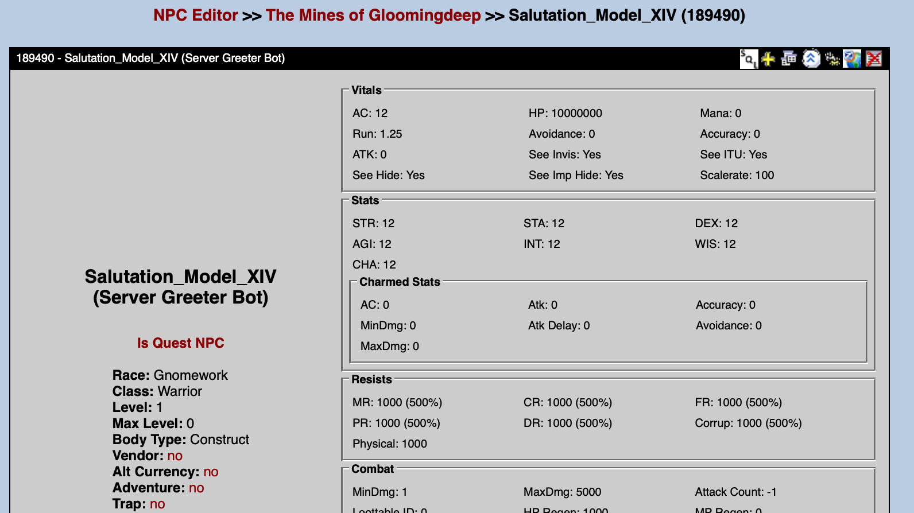

You will also notice that on this screen you have the option to set NPC Faction.  This step will be covered elsewhere, but is an important concept to master as you continue customizing your server.  For the time being, let's leave this area alone.

Congratulations!  You have completed creating your first NPC.  The next step is to make the NPC appear in the world.

## Create the Spawn

NPCs must be assigned additional information to allow them to spawn in the world.  Click on the Spawns tab to create these attributes for your NPC:

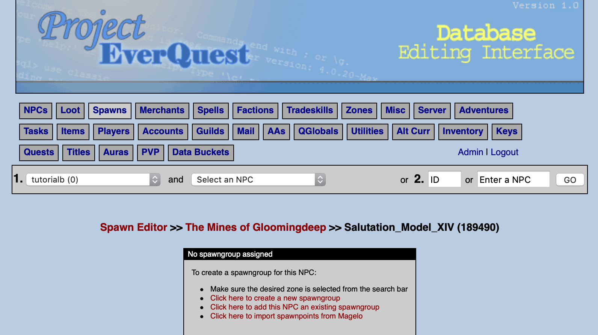

A _Spawngroup_ is a grouping of one or more NPCs.  A Spawngroup can have one member, which will be the case for our Greeter Bot, or it can have many members; a Spawngroup with many members can create a more random feel for your world, since the same NPC may not always appear.  You can review the fields in database table on the [spawngroup](https://docs.eqemu.io/schema/spawns/spawngroup/) page (opens new window) in the Database Schema documentation.

Click on the _Click here to create a new spawngroup_ link.

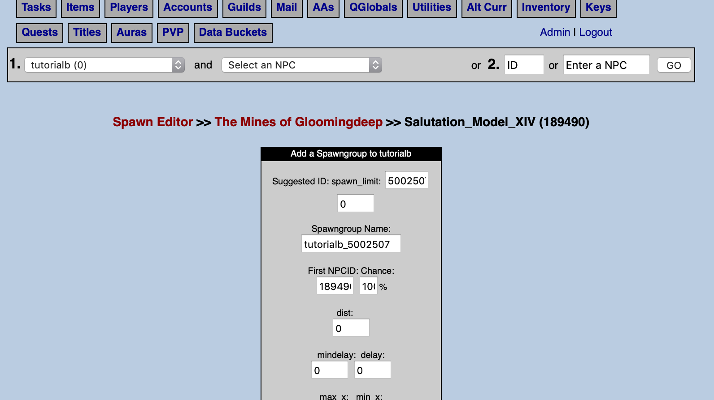

As with the Add an NPC step above, many values are pre-populated in the PEQ Editor to help you out.  Leave the default values and click the _Submit _button.

### Review your Spawngroup

After you click Submit, you will be redirected to a page that allows you to review your Spawngroup. From this page, you can assign additional NPCs to the Spawngroup, delete or rename the Spawngroup, or edit the various settings for the Spawngroup itself, or the settings for the members of the Spawngroup.

Choose the link in yellow text that says _View Spawnpoints (0) for this Spawngroup._

### Create a Spawnpoint

A Spawnpoint is the database entry that determines the location and behavior when the NPC spawns in the world.  These values are stored in the spawn2 table in your database.  You can review the fields of this table on the [spawn2](https://docs.eqemu.io/schema/spawns/spawn2/) page (opens new window) of the Database Schema documentation.

Since there are no Spawnpoints associated with this Spawngroup, this area is empty.

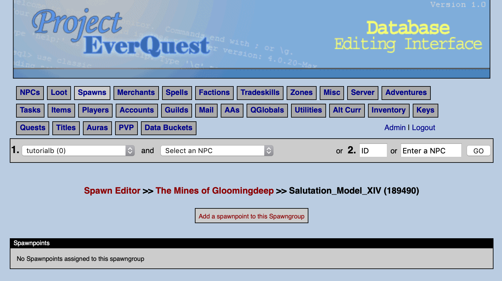

Click the _Add Spawnpoint to this Spawngroup_ link.

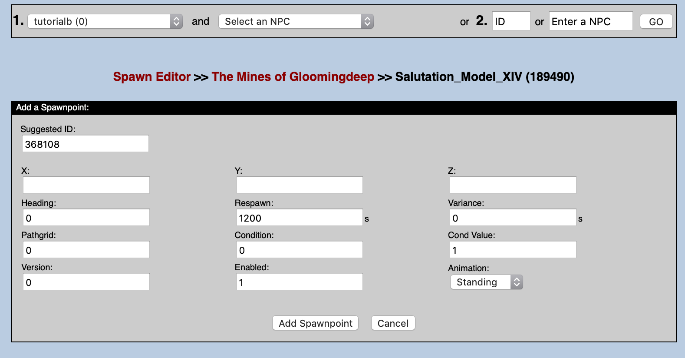

Note that as before, some information has been pre-populated in the Spawnpoint Editor.  Enter in the following values:  _X:_ **-162.35**, _Y:_ **-152.14**, _Z:_ **16.78**, _Pathgrid_: **12**.  Leave the rest of the values set to their default values, and click the _Add Spawnpoint_ button.

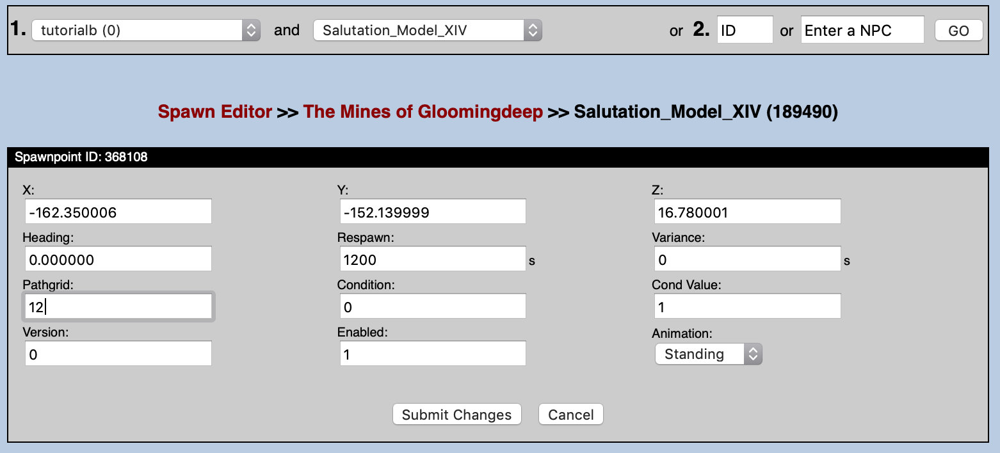

### Review your Spawnpoint

Once you click the _Add Spawnpoint_ button, you are redirected to a page that allows you to review the settings of the Spawnpoint.  Notice that the _Pathgrid_ field is hypertext.  If you follow this link, you are able to manipulate the pathing grid information for this Spawnpoint.

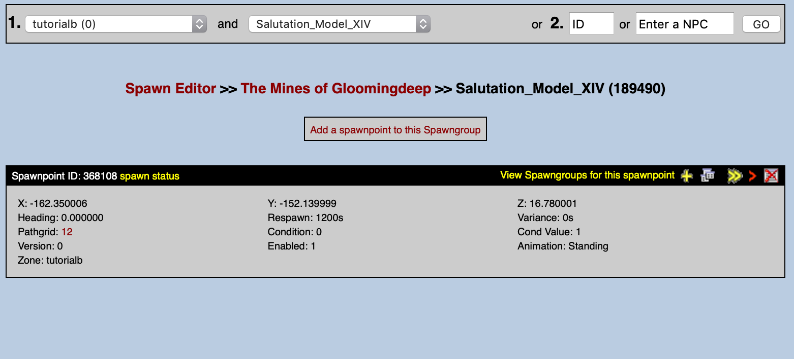

### Create a Pathgrid

A Pathing Grid is the mechanism that allows an NPC to appear as though it is traveling around inside of your world.  This mechanism is separate from Pathing Nodes (which your NPC would follow when chasing a player after losing Line of Sight), and separate from scripted Wandering.  

The Pathing Grid has Wander types, Pause types, and a listing of Waypoints that your NPC will follow.  To review the Grid fields in your database, reference the [grid](https://docs.eqemu.io/schema/grids/grid/) page (opens new window) in the Database Schema documentation.  For information regarding the Waypoint entry fields in your database, reference the [grid_entries](https://docs.eqemu.io/schema/grids/grid_entries/) page (opens new window).

Since we have not defined any information about this particular Pathing Grid, we will do so now.

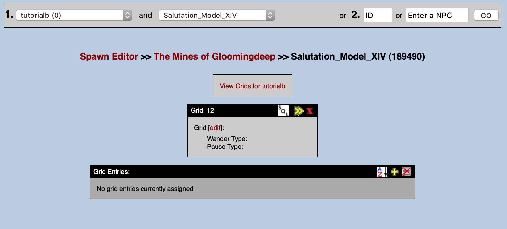

### Edit the Grid

Begin by clicking the _edit_ hyperlink in your PEQ Editor next to the word _Grid_.  This screen allows you to set the Wander and Pause types.  Choose _Wander Type_ 0 - **Circular**, and _Pause Type_ 1 - **Full**.  Once you have made the selections, click the _Submit Changes_ button.

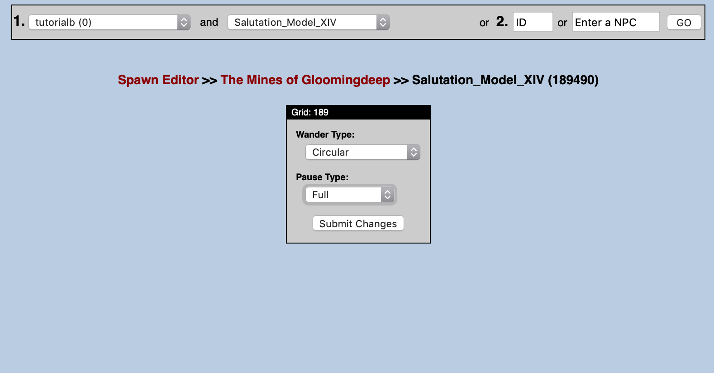

### Add Grid Entries

Click the yellow + icon in the _Grid Entries_ area on the PEQ Editor page.  This will allow you to add a Waypoint.  We are going to repeat this process several times to establish a nice loop for our NPC to travel.

The first Waypoint (waypoint number 0) will be our Spawnpoint, always.  Enter in the values and click the _Submit Changes_ button.  You will be redirected to the Grid Editor review screen.

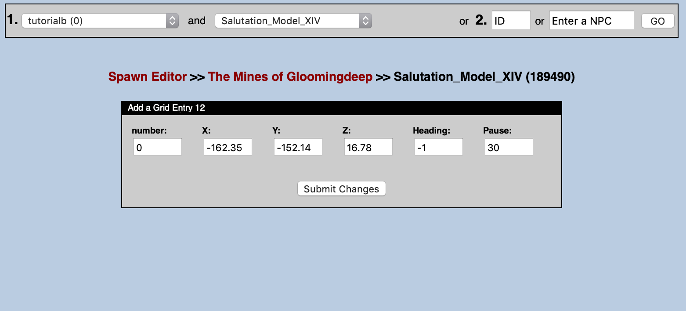

We will enter in a number of Grid Entry Waypoints.  Here is a table of the values for each (note that 0 is repeated in the table, but does not have to be added a second time!).  Keep clicking the yellow + sign to add each Waypoint, input the values below, and submit your changes.

| Number | X        | Y        | Z       | Heading | Pause |
| ------ | -------- | -------- | ------- | ------- | ----- |
| 0      | -162.35  | -152.14  | 16.78   | -1      | 30    |
| 1      | -132.503 | -153.421 | 15.9178 | -1      | 30    |
| 2      | -94.1068 | -148.684 | 14.2662 | -1      | 30    |
| 3      | -34.0962 | -141.684 | 14.7164 | -1      | 30    |
| 4      | 23.1549  | -111.449 | 13.9895 | -1      | 30    |
| 5      | 38.2853  | -40.2572 | 16.5154 | -1      | 30    |
| 6      | -57.144  | -53.4567 | 19.0392 | -1      | 30    |
| 7      | -94.8163 | -2.66101 | 20.0491 | -1      | 30    |
| 8      | -143.811 | -35.4007 | 18.8172 | -1      | 30    |
| 9      | -177.327 | -82.1346 | 19.5479 | -1      | 30    |

Once you have completed entering all of the Grid Entry Waypoints, your screen should look like this:

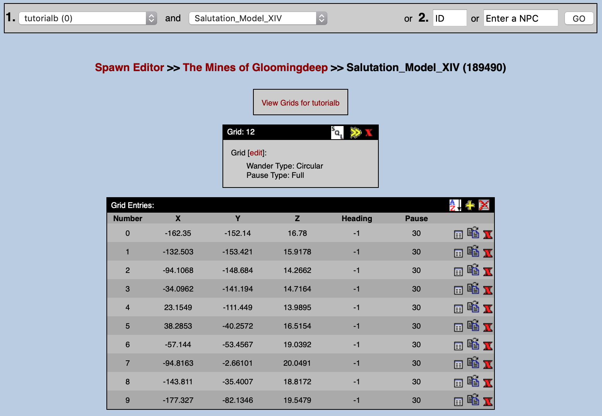

Congratulations!  You have created your first Pathing Grid.  If you want to experiment with different locations, feel free to run around in game and make use of the #loc command to interrogate your current position.  Update the Grid Entries to your desired location.  The next step is to assign a quest script so that we can interact.

## Add a Quest Script

Unfortunately, you cannot add or edit a quest script in the PEQ Editor.  There are many ways to get this information onto your server, including through your own GitHub repository.  For the sake of simplicity, we will simply copy and paste a script in using Terminal in this example.

### Go to your Quests directory

Start by going to the TutorialB directory in your Quest Directory:  `cd /home/eqemu/server/quests/tutorialb/`

### Create the File

Create a new file with your favorite editor:  `nano Salutation_Model_XIV.pl `

### Add the Code

Paste in the following code (fill in the blanks!) and save:

=== "Salutation_Model_XIV.pl"
  ```perl
  #:: Zone: The Mines of Gloomingdeep (tutorialb) >> Salutation_Model_XIV (189490)
  
  sub EVENT_SPAWN {
      quest::emote("whirs to life.");
  }
  
  sub EVENT_SAY {
      if ($text=~/hail/i) {
          quest::say("Hello $name, and welcome to the ______ server!  I'm here to make your life easy, so let me know if you have any [" . quest::saylink("questions") . "], or if you'd like to [" . quest::saylink("leave") . "] the tutorial.");
      }
      elsif ($text=~/questions/i) {
          quest::say("A lot of people wonder about [" . quest::saylink("max level") . "], [" . quest::saylink("expansions") . "], [" . quest::saylink("customizations") . "], [" . quest::saylink("community") . "], [" . quest::saylink("raiding") . "], [" . quest::saylink("server difficulty") . "], [" . quest::saylink("bots") . "], [" . quest::saylink("mercs") . "], [" . quest::saylink("macroquest") . "], and [" . quest::saylink("hot zones") . "].");
      }
      elsif ($text=~/max level/i) {
          quest::say("The maximum level for the server is level ______.");
      }
      elsif ($text=~/expansions/i) {
          quest::say("All zones through the ______ expansion are available.  If a zone requires a key, flag, or reagent to access it, you will have to obtain those on your own.");
      }
      elsif ($text=~/customizations/i) {
          quest::say("We have added a custom item vendor in the Planes of Knowledge--he will sell items for Chronobines to community members who [" . quest::saylink("support the server") . "].  We have included quality of life features such as autocombine for tradeskills, Guild Hall for easy travel, Shadowrest and Guild Lobby for easy corpse recovery, suspended buff timers in non-combat zones, and more!");
      }
      elsif ($text=~/support the server/i) {
          quest::say("Please take a look at our forums and our wiki for more information on contributing to the community.  We reward players with Chronobines for their contributions on bug reports, wiki pages, helping others, and having a great attitude.  We're also happy to accept donations to help offset the cost of server hosting.");
      }
      elsif ($text=~/community/) {
          quest::say("______ has a great community--many people here will help you to adventure, provide you with buffs, give you items, or even just take the time to give you help if you have a question.  OOC is a global channel, so please feel free to use /ooc if you have a question.");
      }
      elsif ($text=~/raiding/i) {
          quest::say("Raid content is 'legit' and will require raid forces to defeat.  We promote a healthy and competitive raid environment and will instance content as needed so that everyone can enjoy the end-game content equally.");
      }
      elsif ($text=~/server difficulty/i) {
          quest::say("There is a server xp bonus to make leveling easier.  We often offer periods of double-loot and/or double-xp.  Please check our forums for the most up to date information.  You can also adventure in [" . quest::saylink("hot zones") . "] if you'd like to progress at even faster rates!");
      }
      elsif ($text=~/hot zones/i) {
          quest::say("Each month (or so) our hot zones rotate.  Please pay a visit to my friend, Franklin Teek, in the Plane of Knowledge for the most up to date information.  You'll find him by the port in area.");
      }
      elsif ($text=~/bots/i) {
          quest::say("We do not use bots on this server.  You are allowed to box three characters at the same time.");
      }
      elsif ($text=~/mercs/i) {
          quest::say("We do not use mercs on this server.  You are allowed to box three characters at the same time.");
      }
      elsif ($text=~/macroquest/i) {
          quest::say("We do not allow the use of MacroQuest on this server.  Please do not make us ask you to stop using it!  We ask that one input from you leads to one output from your character.  There are many EQEmu servers that encourage and allow the use of MacroQuest, so please explore them if you find that you cannot play without it.");
      }
      elsif ($text=~/leave/i) {
          quest::say("I have been programmed to help you leave if you wish to [" . quest::saylink("exit the tutorial") . "].  I will transport you to the Plane of Knowledge.  Please note that you will not be able to re-enter the tutorial once you have reached level 16.  Also, there are some custom items that can be found here--don't rush to leave!");
      }
      elsif ($text=~/exit the tutorial/i) {
          #:: Teleport player to the succor point in the Plane of Knowledge (202 - poknowledge)
          quest::movepc(202,-285,-148,-159);
      }
  }
  
  sub EVENT_WAYPOINT_ARRIVE {
      if ($wp == 2) {
          quest::emote("clicks and whirs");
      }
      elsif ($wp == 5) {
          quest::say("Initiate buff and heal program XI.");
          quest::emote("begins to glow.");
          #:: Cast 2087 - Greater Infusion, 189490 == self
          $npc->CastSpell(2087, 189490);
      }
      elsif ($wp == 10) {
          quest::emote("whirs and clicks");
      }
  }
  
  #:: Zone: The Mines of Gloomingdeep (tutorialb) >> Salutation_Model_XIV (189490)
  ```

Congratulations!  You have added your first quest script to your first NPC!  The next step is to get into the world and see this bot in action.

## In Game Steps

If you're hanging out in The Mines of Gloomingdeep, you can issue three commands to get your bot to spawn.  Be sure to review the [In Game Command Reference](../../../../server/reference-lists/in-game-command-reference) (opens new window) if you're not sure what all of these do.

```
#hotfix
#reloadquest
#repop
```

This will bring over all of your NPC settings, reload your quest files and repop the zone.  At this point your should see your new NPC!

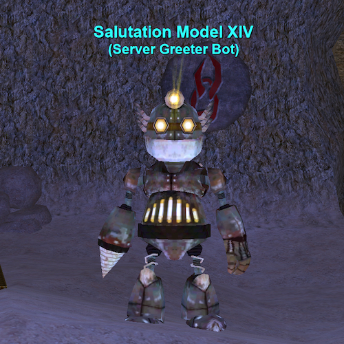

Your NPC should begin to path around and will respond to your messages as indicated in the quest script.  
